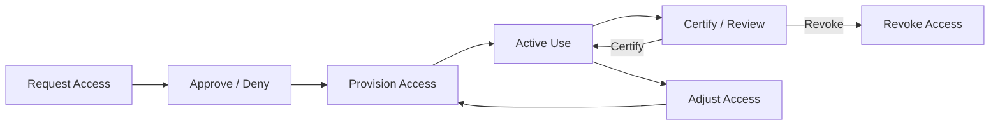

# Identity Governance

Identity Governance and Administration (IGA) is the discipline of managing digital identities and their access rights across an organization. It answers the questions that auditors ask and that security incidents expose: who has access, why they have it, who approved it, and whether they still need it.

This page explains the regulatory landscape that drives IGA adoption, the access lifecycle that IGA manages, why manual processes fail at scale, and how automation addresses these challenges.

## Regulatory Drivers

Organizations do not adopt IGA for convenience -- they adopt it because regulators, auditors, and insurers demand it. The following frameworks directly mandate identity governance controls:

### SOX Section 404 (Sarbanes-Oxley)

Public companies must demonstrate that internal controls over financial reporting are effective. Access to financial systems (ERP, payment processing, general ledger) must be governed with:
- Documented access request and approval processes
- Separation of Duties controls preventing toxic access combinations
- Periodic access reviews (certifications) with evidence of manager sign-off
- Timely deprovisioning when employees change roles or leave

A SOX audit finding related to access control is one of the most common material weaknesses reported. xavyo addresses this through its entitlement model, SoD rule engine, certification campaigns, and lifecycle automation.

### GDPR (General Data Protection Regulation)

The European Union's GDPR requires organizations to demonstrate lawful, proportionate processing of personal data. Identity governance intersects with GDPR through:
- **Data subject access requests (DSAR)** -- producing a complete record of what data is held about an individual
- **Right to erasure** -- removing or anonymizing personal data on request
- **Purpose limitation** -- ensuring access is granted only for documented business purposes
- **Data protection impact assessments** -- evaluating the risks of processing activities
- **Data protection classification** -- categorizing data as personal, sensitive, or special category

xavyo provides GDPR compliance features through its data protection classification system, GDPR report generation, and audit trail. See [Compliance and GDPR](./compliance-gdpr.md) for details.

### NIS2 (Network and Information Security Directive)

The EU's NIS2 directive (effective October 2024) expands cybersecurity requirements to a broader set of critical infrastructure and important entities. Key identity governance requirements include:
- Risk-based access control policies
- Incident response plans that include identity compromise scenarios
- Supply chain security -- governing third-party and machine identity access
- Regular testing of security controls including access management

### SOC 2 Type II

Service organizations demonstrate the operating effectiveness of their controls over a period of time. Trust Service Criteria relevant to identity governance include:
- **CC6.1** -- logical and physical access controls
- **CC6.3** -- role-based access based on job function
- **CC6.6** -- system boundaries and authorized access points

SOC 2 auditors review evidence of access request approvals, periodic access reviews, timely deprovisioning, and segregation of duties. xavyo's audit trail provides this evidence natively.

### ISO 27001 Annex A.9

The international standard for information security management includes control objectives for access management:
- **A.9.1** -- business requirements for access control
- **A.9.2** -- user access management (registration, provisioning, review, removal)
- **A.9.3** -- user responsibilities
- **A.9.4** -- system and application access control

## The Access Lifecycle

IGA manages access through a continuous lifecycle that mirrors the employee journey:

### Request

Access begins with a request. In xavyo, users browse the request catalog, select the entitlements they need, provide a business justification, and submit. The request is automatically checked against SoD rules before entering the approval workflow.

### Approve

Requests flow through configurable multi-step approval workflows. xavyo supports:
- Manager approval (the requester's direct supervisor)
- Application owner approval (the person responsible for the target system)
- Approval groups (rotating panels of authorized approvers)
- Escalation policies (automatic escalation if approvers do not respond within SLA)

### Provision

Approved access is provisioned -- either automatically through connectors (create account, assign permission in the target system) or through manual tasks that are tracked to completion.

### Review

Access is periodically reviewed through certification campaigns. Reviewers examine each user's entitlements and decide to certify (keep) or revoke (remove). xavyo also supports micro-certifications -- event-driven reviews triggered by risk score changes, extended inactivity, or attribute changes.

### Adjust

When a user's attributes change (department transfer, promotion, location move), the lifecycle engine adjusts their access: new birthright entitlements are added and old ones are scheduled for removal.

### Revoke

When a user leaves the organization, all access is revoked. xavyo captures an access snapshot before revocation, deprovisions accounts in connected systems, and maintains the audit trail for compliance.

## Why Manual Processes Fail

Organizations that manage access manually -- through spreadsheets, email approvals, and ad-hoc scripts -- encounter predictable failures as they scale:

**Accumulation without revocation.** Users accumulate entitlements over time as they move between roles. Without automated lifecycle management, old entitlements are rarely removed, violating the principle of least privilege.

**Approval without accountability.** Email-based approval chains lose context, lack audit trails, and create no linkage between the approval and the actual provisioning action. When an auditor asks "who approved this access and when?", the answer is often "we think it was in an email somewhere."

**Review without rigor.** Manual access reviews degenerate into rubber-stamping. When a manager receives a spreadsheet with 500 line items, the cognitive load makes meaningful review impossible. The rational response is to approve everything.

**Response without speed.** When an employee is terminated, the manual process to revoke access across all systems takes hours or days -- a window during which a disgruntled ex-employee may retain access to sensitive systems.

**Visibility without completeness.** Manual processes cannot discover shadow IT, unmanaged service accounts, or access granted directly in target systems that bypasses the governance process.

## How Automation Addresses These Challenges

xavyo automates the access lifecycle at every stage:

| Challenge | Manual Process | xavyo Automation |
|---|---|---|
| Access accumulation | Spreadsheet review once per year | Continuous lifecycle engine adjusts access on every attribute change |
| Approval accountability | Email chains | Structured workflows with timestamped decisions and audit trail |
| Certification rigor | 500-line spreadsheets | Targeted micro-certifications triggered by risk signals |
| Deprovisioning speed | Hours to days | Automatic revocation on lifecycle state change, with connector-driven deprovisioning |
| Shadow IT visibility | Unknown | Reconciliation detects accounts in target systems that are not tracked in xavyo |
| SoD enforcement | Post-hoc audit | Preventive enforcement at assignment time, with continuous detective scanning |
| NHI governance | Not attempted | First-class lifecycle management, credential rotation, certification campaigns |

The goal is not to remove humans from governance decisions -- it is to ensure that humans make decisions with full context (risk scores, SoD impact, peer comparison) and that those decisions are automatically executed and auditable.

## xavyo's Governance Model

xavyo implements governance through several interconnected subsystems:

- **[Separation of Duties](./separation-of-duties.md)** -- define and enforce toxic access combination rules
- **[Lifecycle Management](./lifecycle-management.md)** -- automate Joiner/Mover/Leaver workflows
- **[Non-Human Identities](./non-human-identities.md)** -- govern machine identities with the same rigor as human identities
- **[Compliance and GDPR](./compliance-gdpr.md)** -- meet data protection requirements
- **[Zero Trust Architecture](./zero-trust.md)** -- continuously verify identity and access context
- **[Multi-Tenancy](./multi-tenancy.md)** -- isolate governance data across organizational boundaries
