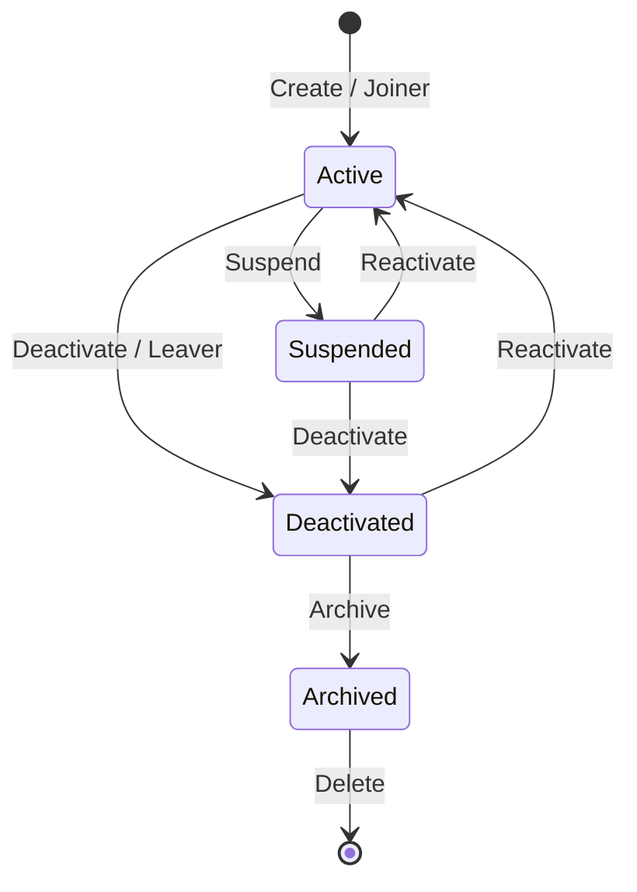
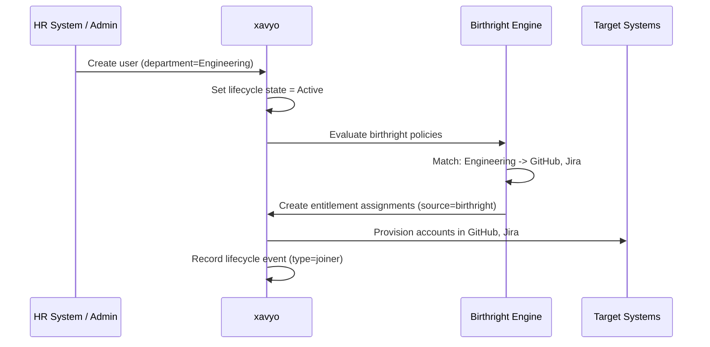
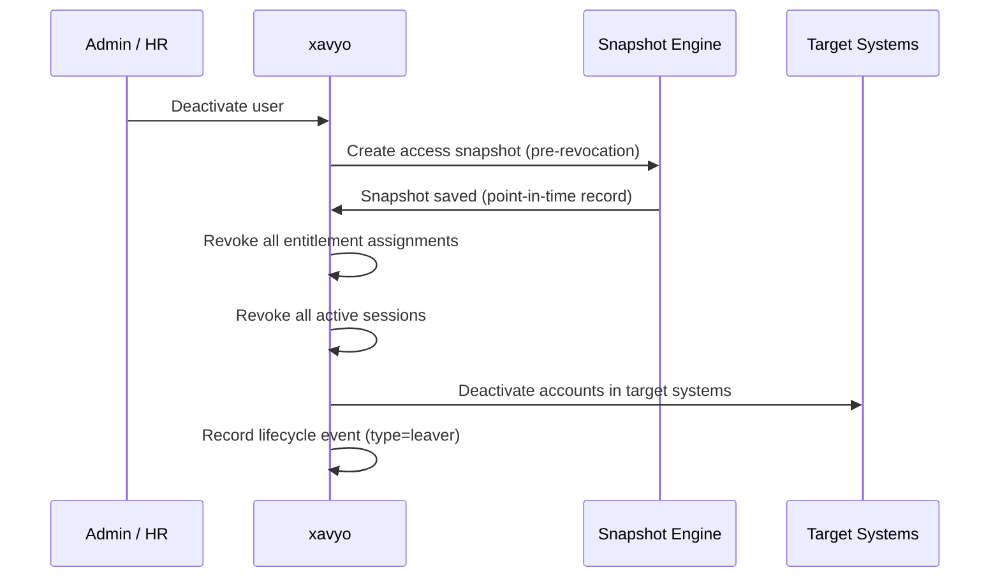

# Identity Lifecycle Management

Identity lifecycle management automates the access changes that accompany every stage of an identity's existence within an organization. When someone joins, their baseline access is provisioned. When they move between departments, their access adjusts. When they leave, their access is revoked. xavyo implements this through the Joiner/Mover/Leaver (JML) pattern with configurable state machines, birthright policies, and scheduled actions.

## Why Lifecycle Automation Matters

Without automated lifecycle management, organizations face predictable problems:

- **New hires wait days for access.** Manual provisioning workflows involve email chains, spreadsheet lookups, and human coordination. The new developer who cannot push code on their first day costs the organization productivity.
- **Movers accumulate excess access.** When an employee transfers from Finance to Engineering, their Finance entitlements typically remain because no one remembers to remove them. Over time, users accumulate entitlements far beyond what their current role requires.
- **Leavers retain access.** A departing employee's accounts in dozens of systems must be disabled individually. IT teams miss systems, especially SaaS applications provisioned outside central IT. A study by Osterman Research found that 35% of organizations have experienced security incidents caused by former employees who retained access.

Lifecycle automation solves these problems by linking access changes to identity events rather than relying on human memory.

## The Lifecycle State Machine

Every identity in xavyo has a lifecycle state managed by a configurable state machine. The default states and transitions are:



### States

| State | Description | Access |
|---|---|---|
| **Active** | The identity is operational and can authenticate | Full access per entitlement assignments |
| **Suspended** | Temporarily disabled (leave of absence, investigation) | No authentication; entitlements preserved |
| **Deactivated** | Permanently disabled (termination, contract end) | No authentication; entitlements revoked |
| **Archived** | Retained for audit compliance; no operational function | No authentication; no entitlements; data retained |

### Configurable State Machines

Tenant administrators can define custom lifecycle configurations with additional states and transitions. For example, an organization might add:
- A **Pending** state for new hires who have been created in HR but have not yet started
- A **Notice Period** state for employees who have resigned but are still working through their notice
- A **Contractor Expired** state for contractors whose engagement has ended

Custom states are defined through the lifecycle configuration API:

```bash
curl -s -X POST "$API/governance/lifecycle/configs" \
  -H "Content-Type: application/json" \
  -H "Authorization: Bearer $ADMIN_JWT" \
  -H "X-Tenant-ID: $TENANT" \
  -d '{
    "name": "Employee Lifecycle",
    "object_type": "user",
    "description": "Standard employee lifecycle with notice period"
  }'
```

## Joiner: Automated Onboarding

When a new user is created, the Joiner workflow provisions their baseline access:

### Birthright Policies

Birthright policies define attribute-based rules that automatically grant access to new users. A birthright policy specifies:
- **Conditions** -- which user attributes must match (department, location, job title)
- **Entitlements** -- which access rights to provision when conditions match
- **Source** -- assignments are tagged with `source=birthright` for traceability

Example: "All users in the Engineering department automatically receive GitHub and Jira entitlements."

```bash
curl -s -X POST "$API/governance/birthright-policies" \
  -H "Content-Type: application/json" \
  -H "Authorization: Bearer $ADMIN_JWT" \
  -H "X-Tenant-ID: $TENANT" \
  -d '{
    "name": "Engineering Birthright",
    "description": "Standard access for Engineering department",
    "conditions": {"department": "Engineering"},
    "entitlement_ids": ["ent-github-id", "ent-jira-id"]
  }'
```

### Birthright Policy Simulation

Before activating a policy, administrators can simulate its impact:

```bash
curl -s -X POST "$API/governance/birthright-policies/$POLICY_ID/simulate" \
  -H "Authorization: Bearer $ADMIN_JWT" \
  -H "X-Tenant-ID: $TENANT"
```

The simulation returns the number of users who would be affected and which entitlements would be provisioned, without making any changes.

### Joiner Flow



## Mover: Automated Access Adjustment

When a user's attributes change -- department transfer, location move, job title change -- the Mover workflow adjusts their access:

### Mover Logic

1. **Detect attribute change.** The lifecycle engine detects that user attributes relevant to birthright policies have changed.
2. **Evaluate new birthright policies.** Determine which entitlements the user should now have based on their new attributes.
3. **Compare with current access.** Identify entitlements to add (new birthright matches) and entitlements to remove (birthright policies that no longer match).
4. **Add new entitlements.** Provision the entitlements that match the new attributes immediately.
5. **Schedule removal of old entitlements.** Old birthright entitlements are not removed immediately -- they are scheduled for revocation after a configurable grace period, allowing the user to wrap up work in their previous role.

### Grace Periods

Grace periods prevent disruption during transitions. If a user moves from Sales to Engineering:
- Engineering entitlements are provisioned immediately
- Sales entitlements are scheduled for revocation after 7 days (configurable)
- If the move is reversed within the grace period, the scheduled revocation is cancelled

### Entitlements Not Affected

Entitlements that are not birthright-sourced (manually assigned, requested through access request workflows, or inherited through group membership) are not affected by mover workflows. Only entitlements tagged with `source=birthright` are subject to automatic adjustment.

## Leaver: Automated Offboarding

When a user is deactivated, the Leaver workflow ensures complete access revocation:

### Leaver Flow



### Access Snapshots

Before revoking access, xavyo captures an **access snapshot** -- a point-in-time record of every entitlement the user held at the moment of deactivation. Access snapshots serve two purposes:

1. **Compliance evidence.** Auditors can see exactly what access a user held before offboarding.
2. **Reactivation support.** If a user is mistakenly deactivated, the snapshot provides a record of what access to restore.

Access snapshots are queryable through the API:

```bash
curl -s "$API/governance/users/$USER_ID/access-snapshots" \
  -H "Authorization: Bearer $ADMIN_JWT" \
  -H "X-Tenant-ID: $TENANT"
```

### Session Revocation

When a user is deactivated, all active sessions are immediately revoked. Existing JWTs continue to validate until they expire (short-lived by design), but refresh token exchanges will fail, preventing new access tokens from being issued.

## Scheduled Actions

Lifecycle transitions can be scheduled for future execution. This enables scenarios like:

- **Pre-termination.** HR enters a termination date two weeks in advance. On that date, the user is automatically deactivated.
- **Contractor expiration.** A contractor engagement has a defined end date. When the date arrives, the contractor account is suspended.
- **Temporary access.** An entitlement is granted for 30 days. After 30 days, it is automatically revoked.

```bash
# Schedule a user suspension for a future date
curl -s -X POST "$API/governance/lifecycle/scheduled" \
  -H "Content-Type: application/json" \
  -H "Authorization: Bearer $ADMIN_JWT" \
  -H "X-Tenant-ID: $TENANT" \
  -d "{
    \"object_type\": \"user\",
    \"object_id\": \"$USER_ID\",
    \"target_state\": \"suspended\",
    \"scheduled_at\": \"2026-03-15T00:00:00Z\",
    \"reason\": \"Leave of absence starting March 15\"
  }"
```

Scheduled actions can be viewed, cancelled, or modified before execution:

```bash
# List pending scheduled actions
curl -s "$API/governance/lifecycle/scheduled" \
  -H "Authorization: Bearer $ADMIN_JWT" \
  -H "X-Tenant-ID: $TENANT"

# Cancel a scheduled action
curl -s -X POST "$API/governance/lifecycle/scheduled/$SCHEDULE_ID/cancel" \
  -H "Authorization: Bearer $ADMIN_JWT" \
  -H "X-Tenant-ID: $TENANT"
```

## Lifecycle Events and Audit

Every lifecycle transition generates a lifecycle event that is recorded in the audit trail:

```bash
# List lifecycle events
curl -s "$API/governance/lifecycle-events" \
  -H "Authorization: Bearer $ADMIN_JWT" \
  -H "X-Tenant-ID: $TENANT"
```

Each event records:
- The identity affected
- The event type (joiner, mover, leaver)
- The before and after states
- The triggering actor (admin user, scheduled task, birthright engine)
- All access changes that resulted from the event
- Timestamp

This audit trail provides the evidence that compliance frameworks require -- a complete record of who had what access, when it changed, and why.

## Bulk Lifecycle Operations

For large-scale changes (organizational restructuring, mass offboarding), xavyo supports bulk lifecycle operations:

```bash
curl -s -X POST "$API/governance/lifecycle/bulk-operations" \
  -H "Content-Type: application/json" \
  -H "Authorization: Bearer $ADMIN_JWT" \
  -H "X-Tenant-ID: $TENANT" \
  -d '{
    "operation_type": "deactivate",
    "user_ids": ["user-1", "user-2", "user-3"],
    "reason": "Office closure - London branch"
  }'
```

Bulk operations are processed asynchronously, tracked through the operations API, and generate individual lifecycle events for each affected user.

## Related Concepts

- **[Identity Governance](./identity-governance.md)** -- the regulatory context for lifecycle management
- **[Separation of Duties](./separation-of-duties.md)** -- how SoD rules interact with birthright provisioning
- **[Non-Human Identities](./non-human-identities.md)** -- lifecycle management for machine identities
- **[Key Concepts](../getting-started/key-concepts.md)** -- overview of all xavyo concepts
