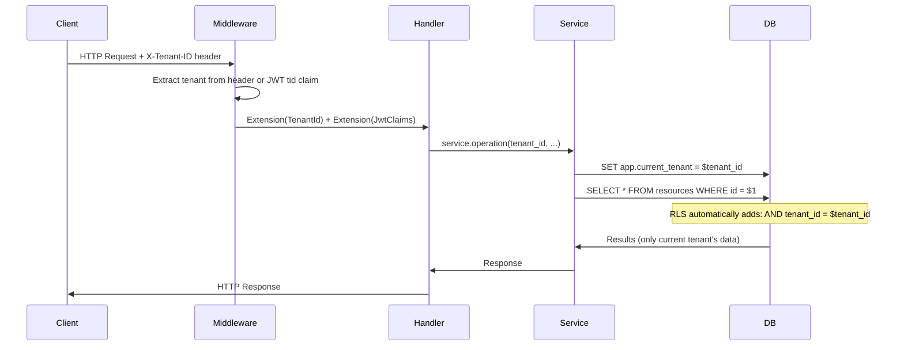

# Multi-Tenancy

xavyo is built as a multi-tenant platform from the ground up. Every piece of data -- users, groups, roles, entitlements, sessions, audit logs -- is scoped to a specific tenant. This page explains the isolation model, how it is enforced, and what it means for different deployment scenarios.

## Isolation Model

xavyo uses a **shared database, shared schema** model with **Row-Level Security (RLS)** enforcement. All tenants share the same PostgreSQL database and the same tables, but each tenant's data is invisible to other tenants at the database engine level.

### Why Shared Schema with RLS?

The three common multi-tenancy models each have tradeoffs:

| Model | Isolation | Operational Cost | Resource Efficiency |
|---|---|---|---|
| Separate databases | Strongest | High (N databases to manage) | Low (idle resources per tenant) |
| Separate schemas | Strong | Medium | Medium |
| Shared schema + RLS | Strong (engine-enforced) | Low (single database) | High (shared resources) |

xavyo chose shared schema with RLS because:

1. **Database-engine enforcement.** RLS policies are evaluated by PostgreSQL, not by application code. A bug in application logic -- a forgotten `WHERE tenant_id = $1` -- cannot leak data because the RLS policy filters it at the engine level.
2. **Operational simplicity.** One database means one backup strategy, one migration pipeline, one monitoring target. Adding a new tenant is a row insert, not a database provisioning workflow.
3. **Resource efficiency.** Tenants with low usage do not consume dedicated resources. Connection pools, memory, and storage are shared across all tenants.

## How RLS Works in xavyo

### The Tenant Context

Every table that holds tenant-scoped data includes a `tenant_id UUID NOT NULL` column. RLS policies on these tables enforce that queries can only see rows matching the current tenant context.

The tenant context is set on each database connection before any queries execute:

```sql
SET app.current_tenant = '00000000-0000-0000-0000-000000000001';
```

### The RLS Policy Pattern

Every tenant-scoped table has a policy following this pattern:

```sql
CREATE POLICY tenant_isolation ON users
  USING (tenant_id = NULLIF(current_setting('app.current_tenant', true), '')::uuid)
  WITH CHECK (tenant_id = NULLIF(current_setting('app.current_tenant', true), '')::uuid);
```

This policy:

- **USING** -- filters SELECT, UPDATE, DELETE to only rows matching the current tenant
- **WITH CHECK** -- ensures INSERT and UPDATE cannot write rows for a different tenant
- **NULLIF** -- if the tenant setting is empty or not set, the comparison fails safely (returns no rows) rather than matching all rows

### Dual Connection Pools

xavyo maintains two database connection pools:

| Pool | User | RLS | Purpose |
|---|---|---|---|
| Application pool | `xavyo_app` | Enforced | All application queries |
| Superuser pool | `xavyo` | Bypassed | Migrations, cross-tenant admin operations |

Normal application requests always use the `xavyo_app` pool, which enforces RLS. The superuser pool is used only for database migrations and platform-level operations that need to operate across tenant boundaries (such as scheduled maintenance tasks).

## Request Flow

The following diagram shows how tenant context flows through a request:



The tenant context is established in two places:

1. **HTTP layer.** The `X-Tenant-ID` header or the `tid` claim in the JWT identifies the tenant. The Tower middleware extracts this and makes it available as an Axum Extension.
2. **Database layer.** Before executing queries, the service layer sets `app.current_tenant` on the database connection. RLS policies then filter all queries automatically.

This defense-in-depth approach means that even if the application code forgets to include `tenant_id` in a WHERE clause, the RLS policy prevents cross-tenant data access.

## The System Tenant

The system tenant (`00000000-0000-0000-0000-000000000001`) serves a special role as the platform administration tenant. It is used for:

- Initial platform bootstrap (creating the first admin user)
- Managing tenant provisioning
- Platform-level configuration

The system tenant is immutable -- it cannot be deleted or renamed. Operations that would modify its core properties are rejected.

## Tenant Provisioning

New tenants are created through the provisioning API:

```bash
curl -s -X POST "$API/tenants/provision" \
  -H "Content-Type: application/json" \
  -H "Authorization: Bearer $SYSTEM_ADMIN_JWT" \
  -d '{
    "name": "Acme Corporation",
    "slug": "acme",
    "admin_email": "admin@acme.com"
  }'
```

Provisioning creates:
- A new tenant record with a unique UUID
- Default security policies (password, MFA, session)
- Default branding configuration
- An initial admin invitation (if admin_email is provided)

No database DDL is required -- the new tenant's data is immediately isolated by the existing RLS policies.

## Tenant Configuration

Each tenant can independently configure:

### Security Policies

- **Password policy** -- minimum length, complexity requirements, history depth, expiration interval
- **MFA policy** -- required for all users, admin only, or optional
- **Session policy** -- maximum concurrent sessions, idle timeout, absolute lifetime
- **IP restrictions** -- allow/deny lists for authentication sources

### Branding

- **Email templates** -- customize the content and appearance of transactional emails (welcome, password reset, email verification, MFA setup, security alerts, account locked)
- **Public branding** -- tenant-specific branding accessible at `/public/branding/{tenant_slug}`

### Settings

Tenant settings are stored as a JSON document, allowing flexible configuration without schema changes:

```bash
curl -s -X PUT "$API/tenants/$TENANT_ID/settings" \
  -H "Content-Type: application/json" \
  -H "Authorization: Bearer $ADMIN_JWT" \
  -d '{
    "max_users": 10000,
    "features": {
      "nhi_enabled": true,
      "governance_enabled": true
    }
  }'
```

## Data Isolation Guarantees

### What is Isolated

Every data object that contains business data is tenant-scoped:
- Users, groups, and group memberships
- Sessions and authentication events
- Roles, entitlements, and assignments
- SoD rules, violations, and exemptions
- Certification campaigns and items
- Connector configurations and sync state
- Webhook subscriptions and deliveries
- Audit logs and SIEM exports
- NHI agents, service accounts, and credentials
- API keys and OAuth clients
- SCIM tokens and SAML certificates

### Cross-Tenant Queries

The application pool (`xavyo_app`) cannot execute cross-tenant queries. This is not a convention -- it is a database constraint. Even a direct SQL query through the application pool connection will be filtered by RLS.

The only way to access data across tenants is through the superuser pool, which is used exclusively for:
- Database migrations (DDL operations)
- Platform-level scheduled tasks (tenant cleanup, statistics aggregation)

### Tenant Deletion

Tenant deletion removes all data associated with a tenant across all tables. This operation uses the superuser pool and is audited. Deleted tenant UUIDs are not reused.

## Deployment Scenarios

### SaaS Multi-Tenant

The primary deployment model: a single xavyo instance serves multiple customers. Each customer is a tenant with full isolation.

- Customers cannot see or access each other's data
- Each customer configures their own policies, branding, and integrations
- Scaling is horizontal (add application replicas) rather than per-tenant

### Enterprise Single-Tenant

Organizations that require dedicated infrastructure can deploy xavyo with a single tenant. The multi-tenant architecture imposes minimal overhead -- the RLS policies still enforce isolation, but there is only one tenant in the system.

### Enterprise Multi-Tenant

Large organizations can use multiple tenants to isolate business units, subsidiaries, or geographic regions within a single deployment. This provides:
- Delegated administration per business unit
- Independent security policies per region (to meet local regulatory requirements)
- Shared infrastructure cost with organizational isolation

## Related Concepts

- **[Zero Trust Architecture](./zero-trust.md)** -- how tenant isolation contributes to blast radius containment
- **[Compliance and GDPR](./compliance-gdpr.md)** -- per-tenant data protection and DSAR handling
- **[Identity Governance](./identity-governance.md)** -- governance controls scoped to tenant boundaries
