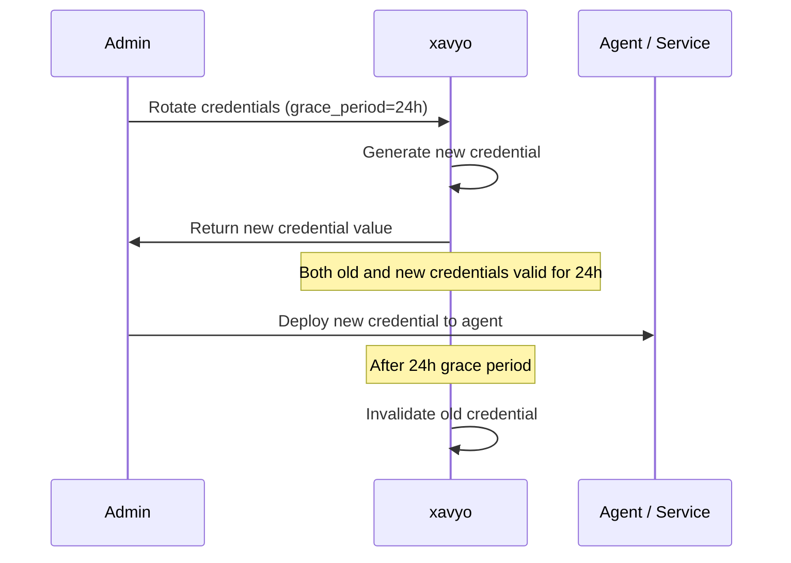

# Non-Human Identities

Non-Human Identities (NHIs) are the credentials, accounts, and access rights used by machines, applications, and automated systems rather than human users. They include service accounts, API keys, CI/CD pipeline credentials, robotic process automation bots, and increasingly, AI agents that act autonomously. In most organizations, NHIs outnumber human identities by a factor of 10 or more -- yet they receive a fraction of the governance attention.

xavyo treats NHIs as first-class citizens with dedicated lifecycle management, credential rotation, usage tracking, risk scoring, and certification campaigns.

## The NHI Challenge

### Machine Identity Sprawl

Every microservice, every CI/CD pipeline, every scheduled job, every SaaS integration, and every AI agent needs credentials to authenticate. These credentials are created by developers, stored in configuration files, environment variables, and secret managers, and often forgotten once they work. The result is machine identity sprawl:

- **No inventory.** Most organizations cannot answer the question "how many service accounts do we have?" with confidence.
- **No ownership.** Service accounts are created by developers who may have since left the organization. There is no one accountable for reviewing or decommissioning them.
- **No rotation.** Credentials created years ago are still in active use because no one is responsible for rotating them. A leaked credential from a 2022 deployment may still grant access today.
- **No governance.** Service accounts bypass the access request and approval workflows that govern human access. They accumulate permissions without review.

### The AI Agent Dimension

AI agents add a new dimension to the NHI challenge. Unlike traditional service accounts that follow predictable patterns (the same API calls at the same frequency), AI agents exhibit emergent behavior:

- They decide which tools to invoke at runtime
- Their access patterns change as they learn and adapt
- They may request access to new resources autonomously
- Their risk profile changes dynamically based on what they are doing

Traditional identity governance tools have no framework for managing identities whose behavior is not predetermined.

## xavyo's NHI Model

xavyo organizes NHIs into three categories, each with tailored management capabilities:

### Agents

An **agent** is an AI system or automated process with autonomous decision-making capabilities. Agents are registered with:

```bash
curl -s -X POST "$API/nhi/agents" \
  -H "Content-Type: application/json" \
  -H "Authorization: Bearer $ADMIN_JWT" \
  -H "X-Tenant-ID: $TENANT" \
  -d '{
    "name": "code-review-agent",
    "agent_type": "autonomous",
    "description": "AI agent that reviews pull requests",
    "risk_level": "medium",
    "owner_id": "human-owner-user-id"
  }'
```

Agent attributes:
- **Name** -- a human-readable identifier
- **Agent type** -- classification of the agent's operational model (autonomous, supervised, tool-calling)
- **Risk level** -- low, medium, high, or critical -- determines the governance rigor applied
- **Owner** -- a human user accountable for the agent's behavior
- **Description** -- purpose and scope documentation

### Service Accounts

A **service account** is a machine identity used for predictable, application-to-application communication:

```bash
curl -s -X POST "$API/nhi/service-accounts" \
  -H "Content-Type: application/json" \
  -H "Authorization: Bearer $ADMIN_JWT" \
  -H "X-Tenant-ID: $TENANT" \
  -d '{
    "name": "billing-service-prod",
    "description": "Production billing microservice",
    "owner_id": "human-owner-user-id"
  }'
```

Service accounts carry the same lifecycle states as human users (active, suspended, deactivated) but with workflows tailored to machine identity patterns.

### Tools

A **tool** is a capability or API endpoint that agents can be authorized to invoke:

```bash
curl -s -X POST "$API/nhi/tools" \
  -H "Content-Type: application/json" \
  -H "Authorization: Bearer $ADMIN_JWT" \
  -H "X-Tenant-ID: $TENANT" \
  -d '{
    "name": "github-pr-review",
    "description": "Review and comment on GitHub pull requests",
    "risk_level": "low"
  }'
```

Tool permissions are explicitly granted to agents, creating an auditable record of what capabilities each agent has.

## Credential Lifecycle

### Credential Types

xavyo supports multiple credential types for NHIs:
- **API keys** -- bearer tokens for API authentication
- **Client credentials** -- OAuth2 client ID and secret pairs
- **Certificates** -- X.509 certificates for mTLS authentication

### Credential Rotation

Credentials can be rotated manually or on a configurable schedule:

```bash
curl -s -X POST "$API/nhi/agents/$AGENT_ID/credentials/rotate" \
  -H "Content-Type: application/json" \
  -H "Authorization: Bearer $ADMIN_JWT" \
  -H "X-Tenant-ID: $TENANT" \
  -d '{
    "credential_type": "api_key",
    "name": "deploy-key-v3",
    "grace_period_hours": 24
  }'
```

The rotation process:



The grace period ensures that credential rotation does not cause service disruption. During the grace period, both the old and new credentials are valid, giving operations teams time to deploy the new credential.

### Credential Revocation

When a credential is compromised, it can be revoked immediately:

```bash
curl -s -X POST "$API/nhi/agents/$AGENT_ID/credentials/$CRED_ID/revoke" \
  -H "Authorization: Bearer $ADMIN_JWT" \
  -H "X-Tenant-ID: $TENANT"
```

Revocation is immediate -- no grace period. The credential is invalidated and cannot be used for authentication.

### Credential Validation

NHI owners can validate that their credentials are still functional:

```bash
curl -s -X POST "$API/nhi/agents/$AGENT_ID/credentials/validate" \
  -H "Authorization: Bearer $ADMIN_JWT" \
  -H "X-Tenant-ID: $TENANT"
```

## Usage Tracking

xavyo tracks how NHIs are used -- which endpoints they access, how frequently, and from which sources:

```bash
# View usage for a specific NHI
curl -s "$API/nhi/agents/$AGENT_ID/usage" \
  -H "Authorization: Bearer $ADMIN_JWT" \
  -H "X-Tenant-ID: $TENANT"

# View usage summary
curl -s "$API/nhi/agents/$AGENT_ID/usage/summary" \
  -H "Authorization: Bearer $ADMIN_JWT" \
  -H "X-Tenant-ID: $TENANT"
```

Usage data feeds into:
- **Staleness detection** -- identifying NHIs that have not been used recently
- **Risk scoring** -- anomalous usage patterns increase the risk score
- **Certification reviews** -- reviewers see usage data when certifying NHI access

## Staleness Detection

The staleness report identifies NHIs that may no longer be needed:

```bash
curl -s "$API/nhi/staleness-report" \
  -H "Authorization: Bearer $ADMIN_JWT" \
  -H "X-Tenant-ID: $TENANT"
```

The report flags:
- NHIs that have not authenticated in a configurable period (e.g., 90 days)
- NHIs with credentials that have not been rotated within the rotation policy
- NHIs with no active usage in their most recent credential lifetime

Stale NHIs are candidates for suspension or decommissioning. Staleness is also a factor in risk score computation.

## NHI Risk Scoring

Each NHI receives a risk score based on multiple factors:

```bash
# View risk score
curl -s "$API/nhi/agents/$AGENT_ID/risk" \
  -H "Authorization: Bearer $ADMIN_JWT" \
  -H "X-Tenant-ID: $TENANT"

# Trigger risk recalculation
curl -s -X POST "$API/nhi/agents/$AGENT_ID/risk/calculate" \
  -H "Authorization: Bearer $ADMIN_JWT" \
  -H "X-Tenant-ID: $TENANT"
```

Risk factors for NHIs:
- **Credential age** -- how long since the last credential rotation
- **Staleness** -- how long since the last usage
- **Privilege level** -- the sensitivity of the tools and resources the NHI can access
- **Anomaly score** -- deviation from the established behavioral baseline
- **Ownership status** -- whether the NHI has an active, accountable owner

Risk scores can trigger enforcement policies:
- **Medium risk** -- flag for review in the next certification campaign
- **High risk** -- notify the owner, require re-certification
- **Critical risk** -- suspend the NHI pending manual review

## Agent-Specific Capabilities

### Behavioral Baselines

xavyo learns a behavioral baseline for each agent -- the normal pattern of tool invocations, access frequencies, and resource usage:

```bash
curl -s "$API/nhi/agents/$AGENT_ID/baseline" \
  -H "Authorization: Bearer $ADMIN_JWT" \
  -H "X-Tenant-ID: $TENANT"
```

### Anomaly Detection

When an agent's behavior deviates from its baseline, anomalies are recorded:

```bash
curl -s "$API/nhi/agents/$AGENT_ID/anomalies" \
  -H "Authorization: Bearer $ADMIN_JWT" \
  -H "X-Tenant-ID: $TENANT"
```

Anomalies can trigger:
- Security alerts to the agent's owner
- Automatic threshold-based responses (warning, suspension)
- Micro-certifications for immediate review

### Tool Permissions

Agent access to tools is explicitly managed:

```bash
# Grant tool access
curl -s -X POST "$API/nhi/agents/$AGENT_ID/permissions" \
  -H "Content-Type: application/json" \
  -H "Authorization: Bearer $ADMIN_JWT" \
  -H "X-Tenant-ID: $TENANT" \
  -d '{
    "tool_id": "tool-github-review",
    "granted_by": "admin-user-id"
  }'

# List agent permissions
curl -s "$API/nhi/agents/$AGENT_ID/permissions" \
  -H "Authorization: Bearer $ADMIN_JWT" \
  -H "X-Tenant-ID: $TENANT"
```

### Security Assessments

Periodic security assessments evaluate an agent's overall risk posture:

```bash
curl -s "$API/nhi/agents/$AGENT_ID/security-assessment" \
  -H "Authorization: Bearer $ADMIN_JWT" \
  -H "X-Tenant-ID: $TENANT"
```

## NHI Certification Campaigns

NHIs require the same periodic review as human identities. xavyo supports dedicated NHI certification campaigns:

```bash
# Create an NHI certification campaign
curl -s -X POST "$API/nhi/certifications/campaigns" \
  -H "Content-Type: application/json" \
  -H "Authorization: Bearer $ADMIN_JWT" \
  -H "X-Tenant-ID: $TENANT" \
  -d '{
    "name": "Q1 2026 NHI Review",
    "description": "Quarterly review of all service accounts and agents"
  }'

# Launch the campaign
curl -s -X POST "$API/nhi/certifications/campaigns/$CAMPAIGN_ID/launch" \
  -H "Authorization: Bearer $ADMIN_JWT" \
  -H "X-Tenant-ID: $TENANT"
```

Campaign items are assigned to NHI owners, who must certify that:
- The NHI is still needed
- Its access level is appropriate
- Its credentials have been rotated within policy
- Its owner information is accurate

NHIs that are not certified can be automatically suspended.

## NHI Governance Workflows

### Service Account Requests

Users can request new service accounts through a formal workflow:

```bash
curl -s -X POST "$API/nhi/service-accounts/requests" \
  -H "Content-Type: application/json" \
  -H "Authorization: Bearer $USER_JWT" \
  -H "X-Tenant-ID: $TENANT" \
  -d '{
    "name": "data-pipeline-staging",
    "justification": "ETL pipeline for staging environment",
    "requested_permissions": ["read-database", "write-s3"]
  }'
```

Requests flow through approval workflows with the same rigor as human access requests.

### Ownership Transfer

When an NHI owner leaves the organization, ownership must be transferred:

```bash
curl -s -X POST "$API/nhi/service-accounts/$SA_ID/transfer-ownership" \
  -H "Content-Type: application/json" \
  -H "Authorization: Bearer $ADMIN_JWT" \
  -H "X-Tenant-ID: $TENANT" \
  -d '{
    "new_owner_id": "new-owner-user-id"
  }'
```

Orphaned NHIs (those whose owner has been deactivated without ownership transfer) are flagged in staleness reports and risk scoring.

## Why NHI Governance Matters

The 2024 Verizon Data Breach Investigations Report found that credential theft and abuse of service accounts are involved in a significant percentage of breaches. Machine identities are attractive targets because:

- They often have broad access to production systems
- They are rarely monitored or audited
- Their credentials are rotated infrequently if at all
- Compromises can go undetected for months

xavyo's NHI governance capabilities address these risks by bringing machine identities under the same governance framework as human identities -- with ownership accountability, credential lifecycle management, usage monitoring, and periodic certification.

## Related Concepts

- **[Identity Governance](./identity-governance.md)** -- the governance framework that encompasses NHI management
- **[Zero Trust Architecture](./zero-trust.md)** -- applying continuous verification to machine identities
- **[Lifecycle Management](./lifecycle-management.md)** -- NHI lifecycle states mirror human identity lifecycle
- **[Key Concepts](../getting-started/key-concepts.md)** -- agents, service accounts, and tools in the domain model
