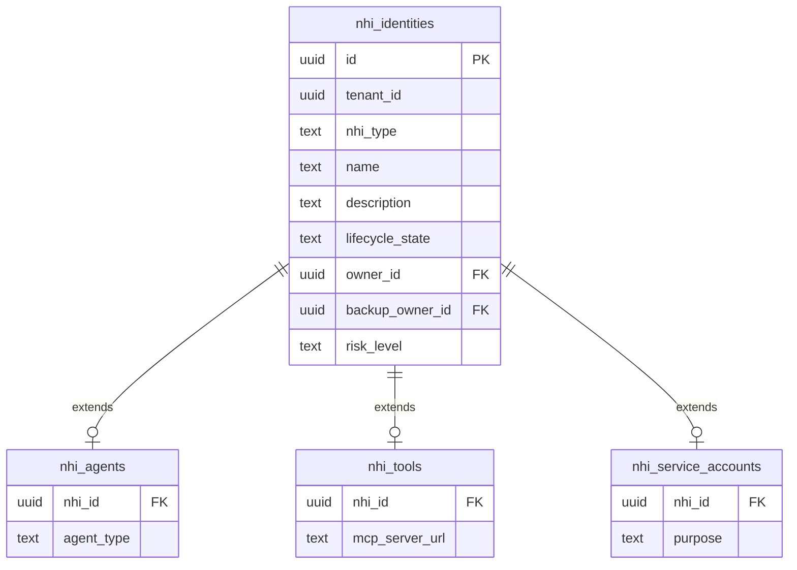
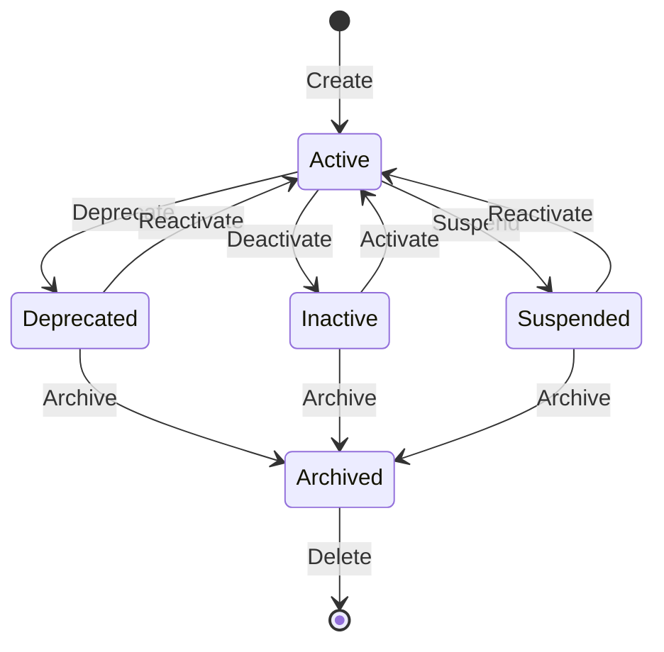

# Non-Human Identities

Non-Human Identities (NHIs) are the credentials, accounts, and access rights used by machines, applications, and automated systems rather than human users. They include service accounts, API keys, CI/CD pipeline credentials, robotic process automation bots, and increasingly, AI agents that act autonomously. In most organizations, NHIs outnumber human identities by a factor of 10 or more -- yet they receive a fraction of the governance attention.

xavyo treats NHIs as first-class citizens with dedicated lifecycle management, credential rotation, usage tracking, risk scoring, and certification campaigns.

## The NHI Challenge

### Machine Identity Sprawl

Every microservice, every CI/CD pipeline, every scheduled job, every SaaS integration, and every AI agent needs credentials to authenticate. These credentials are created by developers, stored in configuration files, environment variables, and secret managers, and often forgotten once they work. The result is machine identity sprawl:

- **No inventory.** Most organizations cannot answer the question "how many service accounts do we have?" with confidence.
- **No ownership.** Service accounts are created by developers who may have since left the organization. There is no one accountable for reviewing or decommissioning them.
- **No rotation.** Credentials created years ago are still in active use because no one is responsible for rotating them. A leaked credential from a 2022 deployment may still grant access today.
- **No governance.** Service accounts bypass the access request and approval workflows that govern human access. They accumulate permissions without review.

### The AI Agent Dimension

AI agents add a new dimension to the NHI challenge. Unlike traditional service accounts that follow predictable patterns (the same API calls at the same frequency), AI agents exhibit emergent behavior:

- They decide which tools to invoke at runtime
- Their access patterns change as they learn and adapt
- They may request access to new resources autonomously
- Their risk profile changes dynamically based on what they are doing

Traditional identity governance tools have no framework for managing identities whose behavior is not predetermined.

## xavyo's NHI Model

### Unified Data Model

xavyo uses a unified data model for all NHI types. The `nhi_identities` base table stores common attributes (name, description, type, lifecycle state, owner, risk level), while type-specific extension tables (`nhi_agents`, `nhi_tools`, `nhi_service_accounts`) store attributes unique to each type.



This model enables unified operations (list all NHIs, search across types, apply lifecycle transitions) while preserving type-specific attributes.

### NHI Types

xavyo organizes NHIs into three categories, each with tailored management capabilities:

#### Agents

An **agent** is an AI system or automated process with autonomous decision-making capabilities:

```bash
curl -s -X POST "$API/nhi/agents" \
  -H "Content-Type: application/json" \
  -H "Authorization: Bearer $ADMIN_JWT" \
  -H "X-Tenant-ID: $TENANT" \
  -d '{
    "name": "code-review-agent",
    "agent_type": "autonomous",
    "description": "AI agent that reviews pull requests",
    "risk_level": "medium",
    "owner_id": "human-owner-user-id"
  }'
```

Agent attributes:
- **Name** -- a human-readable identifier
- **Agent type** -- classification of the agent's operational model (autonomous, supervised, tool-calling)
- **Risk level** -- low, medium, high, or critical -- determines the governance rigor applied
- **Owner** -- a human user accountable for the agent's behavior
- **Backup owner** -- a secondary owner for continuity (must differ from primary owner)
- **Description** -- purpose and scope documentation

#### Service Accounts

A **service account** is a machine identity used for predictable, application-to-application communication:

```bash
curl -s -X POST "$API/nhi/service-accounts" \
  -H "Content-Type: application/json" \
  -H "Authorization: Bearer $ADMIN_JWT" \
  -H "X-Tenant-ID: $TENANT" \
  -d '{
    "name": "billing-service-prod",
    "description": "Production billing microservice",
    "purpose": "Process monthly billing invoices",
    "owner_id": "human-owner-user-id"
  }'
```

Service accounts carry dedicated lifecycle states with workflows tailored to machine identity patterns.

#### Tools

A **tool** is a capability or API endpoint that agents can be authorized to invoke:

```bash
curl -s -X POST "$API/nhi/tools" \
  -H "Content-Type: application/json" \
  -H "Authorization: Bearer $ADMIN_JWT" \
  -H "X-Tenant-ID: $TENANT" \
  -d '{
    "name": "github-pr-review",
    "description": "Review and comment on GitHub pull requests",
    "risk_level": "low"
  }'
```

Tool permissions are explicitly granted to agents, creating an auditable record of what capabilities each agent has. Tools can also be discovered and imported automatically through MCP Discovery (see below).

### Unified Operations

All NHI types can be managed through a unified API alongside the type-specific endpoints:

```bash
# List all NHIs across types
curl -s "$API/nhi" \
  -H "Authorization: Bearer $ADMIN_JWT" \
  -H "X-Tenant-ID: $TENANT"

# Get any NHI by ID (regardless of type)
curl -s "$API/nhi/$NHI_ID" \
  -H "Authorization: Bearer $ADMIN_JWT" \
  -H "X-Tenant-ID: $TENANT"
```

## NHI Lifecycle States

Every NHI follows a lifecycle state machine with five states:



| State | Description | Authentication |
|---|---|---|
| **Active** | Operational, can authenticate and perform actions | Allowed |
| **Inactive** | Disabled, not currently in use | Blocked |
| **Suspended** | Temporarily disabled pending investigation or review | Blocked |
| **Deprecated** | Scheduled for retirement, still functional but flagged | Allowed (with warnings) |
| **Archived** | Retained for audit compliance, no operational function | Blocked |

Lifecycle transitions are managed through dedicated endpoints:

```bash
# Suspend an NHI
curl -s -X POST "$API/nhi/$NHI_ID/suspend" \
  -H "Authorization: Bearer $ADMIN_JWT" \
  -H "X-Tenant-ID: $TENANT"

# Reactivate a suspended NHI
curl -s -X POST "$API/nhi/$NHI_ID/reactivate" \
  -H "Authorization: Bearer $ADMIN_JWT" \
  -H "X-Tenant-ID: $TENANT"

# Deprecate an NHI (signal intent to retire)
curl -s -X POST "$API/nhi/$NHI_ID/deprecate" \
  -H "Authorization: Bearer $ADMIN_JWT" \
  -H "X-Tenant-ID: $TENANT"

# Archive an NHI (retain for audit, no operation)
curl -s -X POST "$API/nhi/$NHI_ID/archive" \
  -H "Authorization: Bearer $ADMIN_JWT" \
  -H "X-Tenant-ID: $TENANT"
```

Lifecycle transitions require appropriate permissions -- non-admin users need explicit `manage` or `admin` permissions on the NHI (see User-to-NHI Permissions below).

## Credential Lifecycle

### Credential Types

xavyo supports multiple credential types for NHIs:
- **API keys** -- bearer tokens for API authentication
- **Client credentials** -- OAuth2 client ID and secret pairs
- **Certificates** -- X.509 certificates for mTLS authentication

### Secret Management (Vault)

Secrets for NHIs are managed through the built-in vault, which provides encrypted storage, lease-based access, and rotation:

```bash
# Store a secret for an NHI
curl -s -X POST "$API/nhi/$NHI_ID/vault/secrets" \
  -H "Content-Type: application/json" \
  -H "Authorization: Bearer $ADMIN_JWT" \
  -H "X-Tenant-ID: $TENANT" \
  -d '{
    "name": "deploy-key-v3",
    "secret_type": "api_key",
    "secret_value": "your-secret-value"
  }'

# Rotate a secret
curl -s -X POST "$API/nhi/$NHI_ID/vault/secrets/$SECRET_ID/rotate" \
  -H "Content-Type: application/json" \
  -H "Authorization: Bearer $ADMIN_JWT" \
  -H "X-Tenant-ID: $TENANT" \
  -d '{"new_value": "rotated-secret-value"}'

# Delete a secret
curl -s -X DELETE "$API/nhi/$NHI_ID/vault/secrets/$SECRET_ID" \
  -H "Authorization: Bearer $ADMIN_JWT" \
  -H "X-Tenant-ID: $TENANT"
```

The vault also supports time-limited **leases** for secret access, ensuring that consumers only have access for the duration they need.

## Inactivity Detection

xavyo detects NHIs that may no longer be needed:

```bash
# Detect inactive NHIs
curl -s -X POST "$API/nhi/inactivity/detect" \
  -H "Content-Type: application/json" \
  -H "Authorization: Bearer $ADMIN_JWT" \
  -H "X-Tenant-ID: $TENANT"

# Auto-suspend inactive NHIs
curl -s -X POST "$API/nhi/inactivity/auto-suspend" \
  -H "Content-Type: application/json" \
  -H "Authorization: Bearer $ADMIN_JWT" \
  -H "X-Tenant-ID: $TENANT"

# Detect orphaned NHIs (owner deactivated)
curl -s -X POST "$API/nhi/orphans/detect" \
  -H "Content-Type: application/json" \
  -H "Authorization: Bearer $ADMIN_JWT" \
  -H "X-Tenant-ID: $TENANT"
```

Inactive NHIs are candidates for suspension or decommissioning. Inactivity is also a factor in risk score computation.

## NHI Risk Scoring

Each NHI receives a risk score based on multiple factors:

```bash
# View risk score for any NHI
curl -s "$API/nhi/$NHI_ID/risk" \
  -H "Authorization: Bearer $ADMIN_JWT" \
  -H "X-Tenant-ID: $TENANT"

# View risk summary across all NHIs
curl -s "$API/nhi/risk-summary" \
  -H "Authorization: Bearer $ADMIN_JWT" \
  -H "X-Tenant-ID: $TENANT"
```

Risk factors for NHIs:
- **Credential age** -- how long since the last credential rotation
- **Staleness** -- how long since the last usage
- **Privilege level** -- the sensitivity of the tools and resources the NHI can access
- **Anomaly score** -- deviation from the established behavioral baseline
- **Ownership status** -- whether the NHI has an active, accountable owner

Risk scores can trigger enforcement policies:
- **Medium risk** -- flag for review in the next certification campaign
- **High risk** -- notify the owner, require re-certification
- **Critical risk** -- suspend the NHI pending manual review

## Agent-Specific Capabilities

### Tool Permissions

Agent access to tools is explicitly managed through grant/revoke endpoints:

```bash
# Grant tool access to an agent
curl -s -X POST "$API/nhi/agents/$AGENT_ID/tools/$TOOL_ID/grant" \
  -H "Content-Type: application/json" \
  -H "Authorization: Bearer $ADMIN_JWT" \
  -H "X-Tenant-ID: $TENANT"

# List tools granted to an agent
curl -s "$API/nhi/agents/$AGENT_ID/tools" \
  -H "Authorization: Bearer $ADMIN_JWT" \
  -H "X-Tenant-ID: $TENANT"

# Revoke tool access from an agent
curl -s -X POST "$API/nhi/agents/$AGENT_ID/tools/$TOOL_ID/revoke" \
  -H "Authorization: Bearer $ADMIN_JWT" \
  -H "X-Tenant-ID: $TENANT"
```

### Risk Assessment

Each NHI has a risk score based on multiple factors:

```bash
# View risk score for an NHI
curl -s "$API/nhi/$NHI_ID/risk" \
  -H "Authorization: Bearer $ADMIN_JWT" \
  -H "X-Tenant-ID: $TENANT"

# View aggregated risk summary across all NHIs
curl -s "$API/nhi/risk-summary" \
  -H "Authorization: Bearer $ADMIN_JWT" \
  -H "X-Tenant-ID: $TENANT"
```

## NHI Certification Campaigns

NHIs require the same periodic review as human identities. xavyo supports dedicated NHI certification campaigns:

```bash
# Create an NHI certification campaign
curl -s -X POST "$API/nhi/certifications/campaigns" \
  -H "Content-Type: application/json" \
  -H "Authorization: Bearer $ADMIN_JWT" \
  -H "X-Tenant-ID: $TENANT" \
  -d '{
    "name": "Q1 2026 NHI Review",
    "description": "Quarterly review of all service accounts and agents"
  }'

# Launch the campaign
curl -s -X POST "$API/nhi/certifications/campaigns/$CAMPAIGN_ID/launch" \
  -H "Authorization: Bearer $ADMIN_JWT" \
  -H "X-Tenant-ID: $TENANT"
```

Campaign items are assigned to NHI owners, who must certify that:
- The NHI is still needed
- Its access level is appropriate
- Its credentials have been rotated within policy
- Its owner information is accurate

NHIs that are not certified can be automatically suspended.

## NHI Governance Workflows

### Service Account Management

Service accounts are created directly by administrators:

```bash
curl -s -X POST "$API/nhi/service-accounts" \
  -H "Content-Type: application/json" \
  -H "Authorization: Bearer $ADMIN_JWT" \
  -H "X-Tenant-ID: $TENANT" \
  -d '{
    "name": "data-pipeline-staging",
    "description": "ETL pipeline for staging environment",
    "purpose": "Data processing",
    "owner_id": "owner-user-id"
  }'
```

Every service account must have an assigned owner -- a human user accountable for the identity's lifecycle. Orphaned NHIs (those whose owner has been deactivated) are flagged by the orphan detection endpoint.

## User-to-NHI Permissions

xavyo implements a permission model that controls which human users can interact with which NHIs. Permissions follow a hierarchy:

| Permission Level | Capabilities |
|---|---|
| **use** | Invoke the NHI, view its status |
| **manage** | Everything in `use`, plus lifecycle transitions, credential rotation |
| **admin** | Everything in `manage`, plus delete, permission grants, ownership transfer |

Administrators and super administrators bypass permission checks entirely for backward compatibility.

```bash
# Grant a user permission to manage an NHI
curl -s -X POST "$API/nhi/$NHI_ID/users/$USER_ID/grant" \
  -H "Content-Type: application/json" \
  -H "Authorization: Bearer $ADMIN_JWT" \
  -H "X-Tenant-ID: $TENANT" \
  -d '{"permission_level": "manage"}'

# List users with permissions on an NHI
curl -s "$API/nhi/$NHI_ID/users" \
  -H "Authorization: Bearer $ADMIN_JWT" \
  -H "X-Tenant-ID: $TENANT"

# List NHIs accessible to a user
curl -s "$API/nhi/users/$USER_ID/accessible" \
  -H "Authorization: Bearer $ADMIN_JWT" \
  -H "X-Tenant-ID: $TENANT"
```

When a non-admin user lists NHIs, the response is filtered to show only NHIs they have explicit permissions for. This ensures that users see only what they are authorized to access.

## NHI-to-NHI Permissions

NHIs can be authorized to call other NHIs, enabling controlled agent-to-agent and service-to-service communication:

```bash
# Grant Agent A permission to call Agent B
curl -s -X POST "$API/nhi/$SOURCE_ID/call/$TARGET_ID/grant" \
  -H "Content-Type: application/json" \
  -H "Authorization: Bearer $ADMIN_JWT" \
  -H "X-Tenant-ID: $TENANT" \
  -d '{"permission_type": "call"}'

# List NHIs that can call a specific NHI
curl -s "$API/nhi/$NHI_ID/callers" \
  -H "Authorization: Bearer $ADMIN_JWT" \
  -H "X-Tenant-ID: $TENANT"

# List NHIs that a specific NHI can call
curl -s "$API/nhi/$NHI_ID/callees" \
  -H "Authorization: Bearer $ADMIN_JWT" \
  -H "X-Tenant-ID: $TENANT"
```

NHI-to-NHI permissions support both `call` and `delegate` types, where delegation allows the target to act on behalf of the source.

## MCP Discovery

The Model Context Protocol (MCP) is a standard for AI agents to discover and invoke tools. xavyo integrates with AgentGateway to provide MCP-based tool discovery and import:

```bash
# List configured gateways for the tenant
curl -s "$API/nhi/mcp-discovery/gateways" \
  -H "Authorization: Bearer $ADMIN_JWT" \
  -H "X-Tenant-ID: $TENANT"

# Discover available MCP tools from gateways
curl -s "$API/nhi/mcp-discovery/tools" \
  -H "Authorization: Bearer $ADMIN_JWT" \
  -H "X-Tenant-ID: $TENANT"

# Import discovered tools as NHI records
curl -s -X POST "$API/nhi/mcp-discovery/import" \
  -H "Content-Type: application/json" \
  -H "Authorization: Bearer $ADMIN_JWT" \
  -H "X-Tenant-ID: $TENANT" \
  -d '{"tool_names": ["github-pr-review", "slack-post-message"]}'
```

MCP Discovery bridges the gap between runtime tool availability and governance -- tools discovered through MCP are automatically registered in xavyo's NHI system, bringing them under lifecycle management, permission control, and certification.

## A2A Protocol

The Agent-to-Agent (A2A) protocol enables asynchronous task management between agents. xavyo implements A2A task endpoints that allow agents to create, monitor, and cancel tasks:

```bash
# Create an A2A task
curl -s -X POST "$API/a2a/tasks" \
  -H "Content-Type: application/json" \
  -H "Authorization: Bearer $AGENT_JWT" \
  -H "X-Tenant-ID: $TENANT" \
  -d '{
    "target_agent_id": "target-agent-id",
    "task_type": "code_review",
    "input": {"repo": "my-project", "pr_number": 42}
  }'

# Check task status
curl -s "$API/a2a/tasks/$TASK_ID" \
  -H "Authorization: Bearer $AGENT_JWT" \
  -H "X-Tenant-ID: $TENANT"

# Cancel a task
curl -s -X POST "$API/a2a/tasks/$TASK_ID/cancel" \
  -H "Authorization: Bearer $AGENT_JWT" \
  -H "X-Tenant-ID: $TENANT"
```

A2A tasks are subject to NHI-to-NHI permission checks -- the source agent must have `call` permission on the target agent to create tasks.

## NHI Vault

xavyo includes a built-in secrets vault for NHI credential management. The vault provides encrypted storage, lease-based access, and automatic rotation:

```bash
# Store a secret for an NHI
curl -s -X POST "$API/nhi/$NHI_ID/vault/secrets" \
  -H "Content-Type: application/json" \
  -H "Authorization: Bearer $ADMIN_JWT" \
  -H "X-Tenant-ID: $TENANT" \
  -d '{
    "name": "database-password",
    "secret_type": "password",
    "value": "the-secret-value",
    "rotation_interval_days": 30,
    "max_lease_duration_secs": 3600,
    "max_concurrent_leases": 5
  }'

# Acquire a lease (time-limited access to the secret)
curl -s -X POST "$API/nhi/$NHI_ID/vault/secrets/$SECRET_ID/lease" \
  -H "Authorization: Bearer $ADMIN_JWT" \
  -H "X-Tenant-ID: $TENANT"

# Rotate a secret
curl -s -X POST "$API/nhi/$NHI_ID/vault/secrets/$SECRET_ID/rotate" \
  -H "Content-Type: application/json" \
  -H "Authorization: Bearer $ADMIN_JWT" \
  -H "X-Tenant-ID: $TENANT" \
  -d '{"value": "new-secret-value"}'
```

Vault features:
- **Lease-based access** -- secrets are accessed through time-limited leases, not permanent grants
- **Concurrent lease limits** -- configurable maximum number of simultaneous leases
- **Rotation tracking** -- automatic reminders when credentials are due for rotation
- **Injection metadata** -- specify how secrets should be injected into the NHI's runtime (environment variable, file, header)

## NHI Separation of Duties

SoD rules can be defined for NHI tool permissions, preventing agents from holding dangerous tool combinations:

```bash
# Create an NHI SoD rule
curl -s -X POST "$API/nhi/sod/rules" \
  -H "Content-Type: application/json" \
  -H "Authorization: Bearer $ADMIN_JWT" \
  -H "X-Tenant-ID: $TENANT" \
  -d '{
    "tool_id_a": "tool-create-payment",
    "tool_id_b": "tool-approve-payment",
    "enforcement": "prevent",
    "description": "Agent must not create and approve payments"
  }'

# Check if a tool grant would violate SoD rules
curl -s -X POST "$API/nhi/sod/check" \
  -H "Content-Type: application/json" \
  -H "Authorization: Bearer $ADMIN_JWT" \
  -H "X-Tenant-ID: $TENANT" \
  -d '{
    "agent_id": "agent-id",
    "tool_id": "tool-approve-payment"
  }'
```

NHI SoD supports two enforcement levels:
- **Prevent** -- block the tool permission grant entirely
- **Warn** -- allow the grant but return a warning to the administrator

See [Separation of Duties](./separation-of-duties.md) for more on how SoD applies to both human and non-human identities.

## Why NHI Governance Matters

The 2024 Verizon Data Breach Investigations Report found that credential theft and abuse of service accounts are involved in a significant percentage of breaches. Machine identities are attractive targets because:

- They often have broad access to production systems
- They are rarely monitored or audited
- Their credentials are rotated infrequently if at all
- Compromises can go undetected for months

xavyo's NHI governance capabilities address these risks by bringing machine identities under the same governance framework as human identities -- with ownership accountability, credential lifecycle management, usage monitoring, and periodic certification.

## Related Concepts

- **[Identity Governance](./identity-governance.md)** -- the governance framework that encompasses NHI management
- **[Zero Trust Architecture](./zero-trust.md)** -- applying continuous verification to machine identities
- **[Lifecycle Management](./lifecycle-management.md)** -- NHI lifecycle states mirror human identity lifecycle
- **[Key Concepts](../getting-started/key-concepts.md)** -- agents, service accounts, and tools in the domain model
