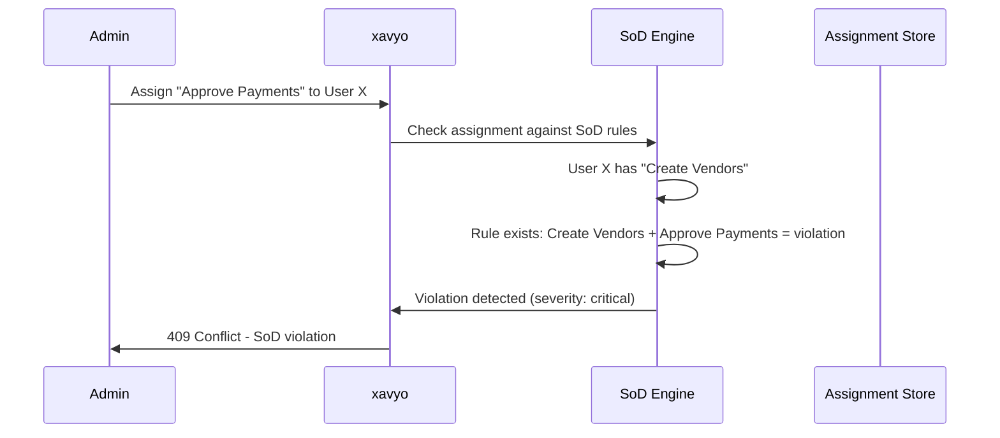

# Separation of Duties

Separation of Duties (SoD) is a governance control that prevents a single person from holding conflicting access rights that could enable fraud, error, or policy violations. The classic example is that the person who creates vendor records should not also have the authority to approve payments to those vendors -- because combining these capabilities creates an opportunity for fraudulent payments.

xavyo implements SoD through conflict rules, preventive enforcement, detective scanning, time-limited exemptions, and integration with certification campaigns.

## The Business Case for SoD

SoD is not an academic exercise -- it addresses real financial and compliance risk:

- **SOX Section 302/404** requires that public companies demonstrate effective internal controls over financial reporting. SoD violations in financial systems are among the most commonly cited control deficiencies.
- **Fraud prevention.** The Association of Certified Fraud Examiners estimates that organizations lose 5% of revenue to fraud annually. SoD controls are one of the most effective preventive measures.
- **Regulatory compliance.** Financial regulators (SEC, FCA, BaFin) routinely cite inadequate segregation of duties as a finding in enforcement actions.
- **Operational risk.** Even without fraudulent intent, a user with conflicting access can make errors that go undetected because the same person performs both the action and the review.

## SoD Rules

### Defining a Rule

An SoD rule identifies two entitlements that should not be held simultaneously by the same user:

```bash
curl -s -X POST "$API/governance/sod-rules" \
  -H "Content-Type: application/json" \
  -H "Authorization: Bearer $ADMIN_JWT" \
  -H "X-Tenant-ID: $TENANT" \
  -d '{
    "name": "Vendor-Payment Segregation",
    "description": "Users who can create vendors must not approve payments",
    "severity": "critical",
    "left_entitlement_id": "ent-create-vendor",
    "right_entitlement_id": "ent-approve-payment"
  }'
```

### Rule Attributes

| Attribute | Description |
|---|---|
| `name` | Human-readable identifier |
| `description` | Business justification for the rule |
| `severity` | `low`, `medium`, `high`, or `critical` -- drives the governance rigor applied |
| `left_entitlement_id` | First entitlement in the conflicting pair |
| `right_entitlement_id` | Second entitlement in the conflicting pair |

### Rule Lifecycle

Rules can be enabled, disabled, and deleted:

```bash
# Disable a rule (keeps it for reference but stops enforcement)
curl -s -X POST "$API/governance/sod-rules/$RULE_ID/disable" \
  -H "Authorization: Bearer $ADMIN_JWT" \
  -H "X-Tenant-ID: $TENANT"

# Re-enable a rule
curl -s -X POST "$API/governance/sod-rules/$RULE_ID/enable" \
  -H "Authorization: Bearer $ADMIN_JWT" \
  -H "X-Tenant-ID: $TENANT"
```

## Preventive Enforcement

Preventive enforcement stops SoD violations before they occur by checking assignment requests against active rules.

### Assignment-Time Checks

When an administrator assigns an entitlement to a user, xavyo automatically checks whether the new assignment would create a violation with any entitlement the user already holds:



If a violation is detected and no valid exemption exists, the assignment is blocked with a clear error message identifying the conflicting entitlements and the rule that was violated.

### Pre-Assignment Checks

Before attempting an assignment, administrators can proactively check whether it would create violations:

```bash
curl -s -X POST "$API/governance/sod-check" \
  -H "Content-Type: application/json" \
  -H "Authorization: Bearer $ADMIN_JWT" \
  -H "X-Tenant-ID: $TENANT" \
  -d '{
    "user_id": "user-x-id",
    "entitlement_id": "ent-approve-payment"
  }'
```

The response indicates whether the assignment would violate any SoD rules and provides details about each potential violation.

### Bulk Assignment Checks

When bulk assignments are processed, SoD checks run for each individual assignment. Assignments that would create violations are rejected while non-violating assignments proceed. This ensures that a single problematic assignment does not block the entire batch.

## Detective Scanning

Detective scanning identifies existing SoD violations -- access combinations that were created before the rule was defined, or that were introduced through direct system access that bypassed governance controls.

### Triggering a Scan

```bash
curl -s -X POST "$API/governance/sod-rules/$RULE_ID/scan" \
  -H "Authorization: Bearer $ADMIN_JWT" \
  -H "X-Tenant-ID: $TENANT"
```

The scan examines all users who hold either entitlement in the rule and identifies those who hold both.

### Viewing Violations

```bash
# List all violations
curl -s "$API/governance/sod-violations" \
  -H "Authorization: Bearer $ADMIN_JWT" \
  -H "X-Tenant-ID: $TENANT"

# Get details of a specific violation
curl -s "$API/governance/sod-violations/$VIOLATION_ID" \
  -H "Authorization: Bearer $ADMIN_JWT" \
  -H "X-Tenant-ID: $TENANT"
```

Each violation record includes:
- The user who holds the conflicting access
- The two conflicting entitlements
- The SoD rule that was violated
- The severity level
- The detection timestamp
- Whether the violation has been remediated or has an active exemption

## Remediation

When violations are detected, they must be remediated -- by removing one of the conflicting entitlements from the user:

```bash
curl -s -X POST "$API/governance/sod-violations/$VIOLATION_ID/remediate" \
  -H "Content-Type: application/json" \
  -H "Authorization: Bearer $ADMIN_JWT" \
  -H "X-Tenant-ID: $TENANT" \
  -d '{
    "action": "revoke",
    "entitlement_id": "ent-approve-payment",
    "comment": "Revoking payment approval to resolve SoD violation"
  }'
```

Remediation is recorded in the audit trail with the acting administrator, the action taken, and the justification.

## Exemptions

Real-world scenarios sometimes require controlled exceptions to SoD rules. A small organization might have a single finance team member who must both create vendors and approve payments because there is no one else to perform the second function. xavyo handles this through time-limited exemptions.

### Creating an Exemption

```bash
curl -s -X POST "$API/governance/sod-exemptions" \
  -H "Content-Type: application/json" \
  -H "Authorization: Bearer $ADMIN_JWT" \
  -H "X-Tenant-ID: $TENANT" \
  -d '{
    "rule_id": "sod-rule-id",
    "user_id": "user-x-id",
    "justification": "Single finance team member; compensating control: all payments over $10K require CEO approval",
    "expires_at": "2026-06-30T23:59:59Z"
  }'
```

### Exemption Properties

- **Time-limited.** Every exemption has an expiration date. There are no permanent exemptions -- this forces periodic re-evaluation of whether the exception is still necessary.
- **Documented.** A business justification is required and stored as part of the exemption record.
- **Auditable.** The creation, modification, and expiration of exemptions are recorded in the audit trail.
- **Revocable.** Exemptions can be revoked before their expiration date:

```bash
curl -s -X POST "$API/governance/sod-exemptions/$EXEMPTION_ID/revoke" \
  -H "Authorization: Bearer $ADMIN_JWT" \
  -H "X-Tenant-ID: $TENANT"
```

### Exemption Enforcement

When a user has a valid (non-expired, non-revoked) exemption for a specific rule:
- Assignment requests that would violate the exempted rule are allowed
- The violation is still recorded as an "exempted violation" for audit purposes
- Risk scoring accounts for the exempted violation as a factor

When the exemption expires:
- The SoD rule is enforced again
- If the user still holds both conflicting entitlements, a new violation is detected
- The violation appears in violation reports for remediation

## Integration with Certifications

SoD violations surface in certification campaigns. When a reviewer certifies a user's access during a campaign, any active SoD violations associated with that user's entitlements are highlighted:

- The reviewer sees which entitlements form toxic combinations
- The reviewer can choose to revoke one of the conflicting entitlements as part of the certification decision
- Certification decisions that would maintain a violation are flagged for escalation

Micro-certifications can be triggered automatically when a new SoD violation is detected, ensuring that violations receive prompt attention rather than waiting for the next quarterly review.

## SoD and Risk Scoring

SoD violations are a factor in risk score computation:

- **Active violations** increase the user's risk score proportionally to the violation severity
- **Exempted violations** contribute a reduced risk factor (the exemption mitigates but does not eliminate risk)
- **Remediated violations** do not affect the current risk score but remain in the violation history

High risk scores triggered by SoD violations can activate enforcement policies (step-up MFA, mandatory certification, access suspension) as described in [Zero Trust Architecture](./zero-trust.md).

## Cross-Application SoD

SoD rules are not limited to a single application. A rule can reference entitlements from different applications, enabling cross-application segregation. For example:

- "Create Vendor" in the ERP system + "Approve Payment" in the banking system
- "Deploy Code" in the CI/CD platform + "Approve Deployment" in the change management system

Cross-application SoD is enforced through the same mechanisms -- preventive checks at assignment time and detective scans across the entire entitlement landscape.

## NHI Separation of Duties

SoD is not limited to human identities. AI agents and service accounts that hold tool permissions are subject to the same principle -- an agent that can both create and approve financial transactions presents the same risk as a human user with that combination.

xavyo provides dedicated NHI SoD rules that operate on tool permissions rather than entitlements:

```bash
# Create an NHI SoD rule
curl -s -X POST "$API/nhi/sod/rules" \
  -H "Content-Type: application/json" \
  -H "Authorization: Bearer $ADMIN_JWT" \
  -H "X-Tenant-ID: $TENANT" \
  -d '{
    "tool_id_a": "tool-create-payment",
    "tool_id_b": "tool-approve-payment",
    "enforcement": "prevent",
    "description": "Agent must not create and approve payments"
  }'

# Check a proposed tool grant against SoD rules
curl -s -X POST "$API/nhi/sod/check" \
  -H "Content-Type: application/json" \
  -H "Authorization: Bearer $ADMIN_JWT" \
  -H "X-Tenant-ID: $TENANT" \
  -d '{
    "agent_id": "agent-id",
    "tool_id": "tool-approve-payment"
  }'
```

### NHI SoD Enforcement Levels

NHI SoD rules support two enforcement levels:

| Level | Behavior |
|---|---|
| **Prevent** | Block the tool permission grant entirely -- the agent cannot hold both tools |
| **Warn** | Allow the grant but return a warning to the administrator |

The `warn` level is useful during initial SoD rollout, enabling organizations to discover existing violations before switching to preventive enforcement.

### NHI vs. User SoD

| Aspect | User SoD | NHI SoD |
|---|---|---|
| **Target** | Entitlement assignments to users | Tool permission grants to agents |
| **API** | `/governance/sod-rules` | `/nhi/sod/rules` |
| **Check** | `/governance/sod-check` | `/nhi/sod/check` |
| **Enforcement** | Block assignment | Prevent or warn on grant |
| **Exemptions** | Time-limited exemptions with justification | Not yet supported |

Both systems serve the same governance objective -- preventing a single identity from holding conflicting access rights -- but they operate on different permission models appropriate to their identity types.

## Related Concepts

- **[Identity Governance](./identity-governance.md)** -- the regulatory context for SoD controls
- **[Lifecycle Management](./lifecycle-management.md)** -- how birthright provisioning interacts with SoD rules
- **[Non-Human Identities](./non-human-identities.md)** -- NHI lifecycle and tool permission governance
- **[Zero Trust Architecture](./zero-trust.md)** -- risk-based enforcement triggered by SoD violations
- **[Key Concepts](../getting-started/key-concepts.md)** -- entitlements, roles, and the access model
