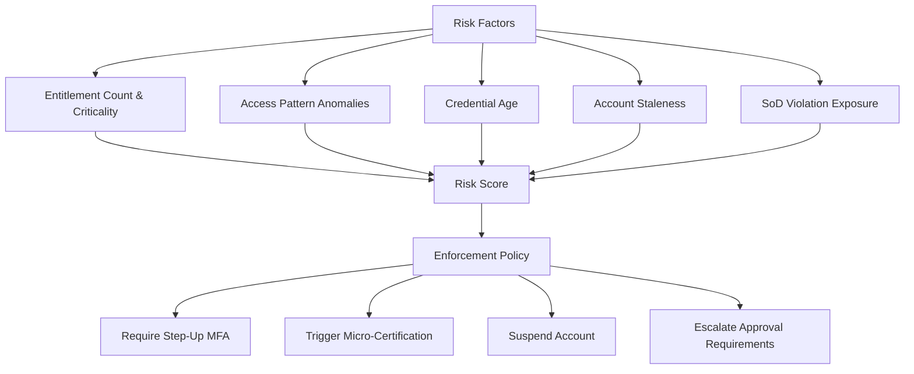

# Zero Trust Architecture

Zero trust is a security model that eliminates implicit trust. Instead of assuming that users and devices inside a network perimeter are safe, zero trust requires continuous verification of every identity, device, and request. xavyo implements zero trust principles throughout its identity and access management capabilities.

## Core Principles

The zero trust model rests on three pillars, each of which maps directly to xavyo capabilities:

### Never Trust, Always Verify

Every request to xavyo carries an authentication token (JWT) that is validated on every call. There is no "trusted zone" -- even requests from internal networks must present valid credentials with a valid tenant context.

xavyo enforces this through:

- **JWT validation on every request.** The Tower middleware stack validates the token signature, expiration, and tenant claim before the request reaches any handler.
- **Tenant context verification.** Every request must include an `X-Tenant-ID` header or carry a `tid` claim in the JWT. The database layer enforces this through Row-Level Security -- queries without tenant context return empty results.
- **Session binding.** Tokens are bound to a specific session that tracks device information, IP address, and activity timestamps. A token from a revoked session is rejected even if it has not expired.

### Least Privilege

Users and machines should have only the minimum access required for their current task. xavyo implements least privilege through:

- **Entitlement-based access.** Rather than broad role assignments, xavyo manages fine-grained entitlements that map to specific capabilities within applications.
- **Birthright policies.** When a user joins or changes roles, birthright policies ensure they receive exactly the access their new position requires -- no more, no less. Access from previous roles is automatically scheduled for revocation.
- **Time-limited access.** Entitlement assignments can have expiration dates. Temporary access for projects or investigations is automatically revoked when the time window closes.
- **SoD enforcement.** Separation of Duties rules prevent users from accumulating toxic combinations of entitlements, even when each individual entitlement would be appropriate.
- **Micro-certifications.** Rather than annual access reviews, xavyo triggers targeted reviews when risk signals change -- a user gains a high-risk entitlement, an account is inactive for an extended period, or access patterns deviate from the baseline.

### Assume Breach

Zero trust assumes that breaches will occur and designs systems to limit blast radius:

- **Tenant isolation.** A compromise of one tenant's data does not expose other tenants. Row-Level Security enforces this at the database level, independent of application logic.
- **Short-lived tokens.** Access tokens have configurable expiration (default: 1 hour). Even if a token is stolen, it is valid for a limited window.
- **Credential rotation.** NHI credentials (API keys, service account secrets) can be rotated automatically on configurable schedules. Old credentials are invalidated after a grace period.
- **Audit trail.** Every authentication event, access decision, and administrative change is recorded in an immutable audit log. Anomalous patterns can be detected through SIEM integration.

## Multi-Factor Authentication

xavyo supports multiple authentication factors that can be required based on risk context:

### Supported Factors

- **TOTP (Time-based One-Time Password)** -- standard RFC 6238 TOTP codes compatible with authenticator apps
- **WebAuthn / FIDO2** -- hardware security keys and platform authenticators (fingerprint, face recognition)
- **Recovery codes** -- one-time backup codes for account recovery

### Risk-Based MFA

MFA requirements can be configured at the tenant level and enforced dynamically:

- Require MFA for all users, or only for users with admin roles
- Step-up authentication for sensitive operations (accessing high-risk entitlements, approving payments)
- Per-tenant MFA policies that tenants configure independently

### MFA Policy Enforcement

When a tenant requires MFA, xavyo enforces it consistently:
- Users cannot disable MFA if the tenant policy requires it
- Federated logins from OIDC and SAML providers respect the tenant's MFA requirements
- Session tokens carry claims indicating the authentication level achieved

## Session Management

Sessions are the runtime expression of an identity's authenticated state. xavyo manages sessions with zero trust principles:

### Session Controls

- **Maximum concurrent sessions.** Prevent a single user from having unlimited active sessions. When the limit is exceeded, the oldest session is revoked.
- **Idle timeout.** Sessions that have not been used within a configurable period are automatically expired.
- **Absolute lifetime.** Sessions have a maximum lifetime regardless of activity, requiring periodic re-authentication.
- **Device binding.** Sessions track the device (user agent, IP) that created them. Anomalous device changes can trigger re-authentication.

### Session Revocation

Sessions can be revoked at multiple granularities:
- Single session (`POST /auth/logout`)
- All sessions for a user (`POST /auth/tokens/revoke-user`)
- Bulk revocation by token (`POST /auth/tokens/revoke`)

When a user's lifecycle state changes (suspended, deactivated), all active sessions are automatically revoked.

## Device Trust

xavyo tracks devices associated with user sessions to establish trust baselines:

- **Device registration.** Users can view and manage their registered devices through the self-service API.
- **Known device detection.** Authentication from a previously registered device can reduce friction (skip step-up MFA for known devices).
- **Anomaly detection.** Authentication from an unrecognized device or unusual location triggers security alerts and can require additional verification.

## IP Restriction Policies

Tenant administrators can configure IP-based access controls:

- **Allow lists.** Restrict authentication to specific IP ranges (office networks, VPN endpoints).
- **Deny lists.** Block authentication from known-bad IP ranges.
- **Validation.** IP restriction rules are validated before activation to prevent lockout.

IP restrictions complement -- but do not replace -- token-based authentication. A request from an allowed IP still requires valid credentials.

## Risk-Based Access Decisions

xavyo computes risk scores for users and NHIs based on multiple factors:

### Risk Factors

Risk scores are computed from configurable factors:
- **Entitlement risk** -- the aggregate risk level of all entitlements held
- **SoD violations** -- active violations or exemptions that represent residual risk
- **Access patterns** -- deviations from established behavioral baselines
- **Credential hygiene** -- age of credentials relative to rotation policy
- **Staleness** -- time since last authentication (long-dormant accounts represent higher risk)

### Enforcement Policies

Risk scores can trigger automated actions:
- **Low risk** -- standard access, no additional controls
- **Medium risk** -- require periodic recertification, flag for review
- **High risk** -- require step-up MFA for sensitive operations
- **Critical risk** -- suspend account pending manual review

## Continuous Verification in Practice

The following sequence shows how zero trust principles apply to a typical interaction:

1. A user authenticates with email/password and completes MFA challenge.
2. xavyo issues a short-lived JWT with claims: user ID, tenant ID, roles, authentication level.
3. The user requests access to a high-risk entitlement.
4. xavyo checks: Is the JWT valid? Is the session active? Does the user have the required role? Does the SoD check pass? Is the user's risk score within acceptable bounds?
5. If the risk score exceeds a threshold, xavyo requires step-up authentication before granting the access.
6. The access decision and all context are recorded in the audit trail.
7. When the JWT expires, the user must re-authenticate using the refresh token, and all checks are repeated.

This continuous verification cycle ensures that access decisions are based on current context, not stale assumptions.

## Related Concepts

- **[Multi-Tenancy](./multi-tenancy.md)** -- how tenant isolation limits blast radius
- **[Separation of Duties](./separation-of-duties.md)** -- preventing toxic access combinations
- **[Lifecycle Management](./lifecycle-management.md)** -- automated access adjustment on attribute changes
- **[Non-Human Identities](./non-human-identities.md)** -- applying zero trust to machine identities
