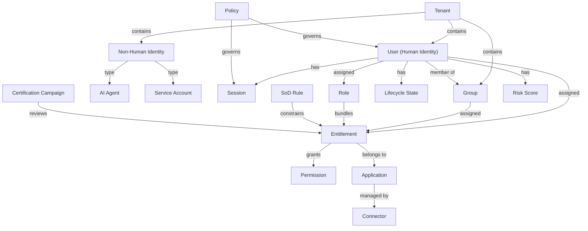

# Key Concepts

xavyo's domain model is organized around a set of interconnected concepts that span authentication, governance, provisioning, and compliance. This page defines each concept and explains how they relate to one another.

## Concept Map

The following diagram shows the major entities and their relationships:

## Identity Foundation

### Tenant

A **tenant** is the top-level isolation boundary. Every user, group, role, entitlement, connector, and policy belongs to exactly one tenant. Tenants share the same database but their data is cryptographically isolated through PostgreSQL Row-Level Security -- a query executing in the context of Tenant A cannot see or modify Tenant B's data, even if the application code contains a bug.

Each tenant has:
- A unique identifier (UUID)
- Configuration settings (password policies, MFA requirements, session limits)
- Its own set of users, groups, and governance objects
- Branding configuration for email templates

The **system tenant** (`00000000-0000-0000-0000-000000000001`) is a special tenant used for platform-level administration. New tenants are provisioned through the `/tenants/provision` endpoint.

See: [Multi-Tenancy](../concepts/multi-tenancy.md)

### User

A **user** represents a human identity. Users authenticate through one or more methods (password, social login, SAML, OIDC federation, passwordless magic links) and receive a JWT that carries their identity claims.

Key attributes:
- **Email** -- the primary identifier, unique within a tenant
- **Lifecycle state** -- active, suspended, deactivated, or archived (see [Lifecycle Management](../concepts/lifecycle-management.md))
- **Custom attributes** -- extensible key-value metadata defined by tenant administrators
- **Risk score** -- a computed value based on access patterns, anomalies, and privilege level

Users can be created through:
- Self-registration (`POST /auth/signup`)
- Admin creation (`POST /users`)
- SCIM provisioning from an upstream identity provider
- Bulk import from CSV files
- Invitation workflows

### Group

A **group** organizes users into logical collections. Groups support:
- **Hierarchical structure** -- groups can have parent/child relationships, forming a tree
- **Membership inheritance** -- a user in a child group is implicitly a member of all ancestor groups
- **Entitlement assignment** -- entitlements assigned to a group apply to all members
- **Types** -- groups can represent departments, teams, projects, or any organizational construct

Groups are identified by a `display_name` and can be managed through the REST API, SCIM 2.0, or LDAP synchronization.

### Session

A **session** represents an authenticated user's active connection to xavyo. Sessions are created on successful login and carry:
- Access token (short-lived JWT with user claims, roles, and tenant context)
- Refresh token (long-lived, used to obtain new access tokens)
- Device information (user agent, IP address)
- Activity timestamps

Sessions can be revoked individually, in bulk (all sessions for a user), or by policy (maximum concurrent sessions, idle timeout, absolute timeout).

## Access Model

### Application

An **application** represents a system or service whose access rights are governed by xavyo. Applications are registered in the governance catalog with metadata including type (internal or external), owner, description, and data protection classification.

Applications are the organizational container for entitlements. Before you can define what access rights exist, you must register the application those rights belong to.

### Entitlement

An **entitlement** is a specific access right within an application -- the atomic unit of access that IGA manages. Examples: "read production database", "approve purchase orders", "deploy to staging environment".

Each entitlement has:
- **Risk level** -- low, medium, high, or critical, determining the governance rigor applied
- **Owner** -- the person accountable for certifying and reviewing this access right
- **Application** -- the system this entitlement belongs to

Entitlements can be assigned directly to users, to groups (inherited by all members), or bundled into roles.

See: [Separation of Duties](../concepts/separation-of-duties.md) for how entitlements interact with SoD rules.

### Role

A **role** is a named bundle of entitlements that represents a job function or organizational responsibility. Roles simplify access management -- instead of assigning 20 individual entitlements to each new developer, you assign the "Developer" role.

xavyo supports several role concepts:

- **Standard roles** -- manually defined bundles of entitlements
- **Hierarchical roles** -- roles can inherit from parent roles, forming a role tree
- **Meta-roles** -- dynamic roles with criteria-based membership (e.g., "all users in Engineering with manager title")
- **Parameterized roles** -- roles with parameters that customize the entitlements (e.g., "Database Admin" with a `database_name` parameter)
- **Role mining** -- an analytics feature that examines existing access patterns and suggests optimal role definitions

### Permission

A **permission** is a fine-grained authorization check evaluated at runtime. While entitlements represent what access has been granted, permissions represent what actions are allowed in a specific context. The authorization engine evaluates permissions against policies that can consider:
- User roles and entitlements
- Time of day and location
- Device trust level
- Risk score
- Custom attributes

### Separation of Duties (SoD)

**SoD rules** define pairs of entitlements that should never be held simultaneously by the same user -- toxic combinations that could enable fraud or error. For example, a user should not be able to both create vendors and approve payments.

SoD enforcement operates at two levels:
- **Preventive** -- assignment requests are checked against SoD rules before they are approved
- **Detective** -- periodic scans identify existing violations that may have been introduced before the rule was created

See: [Separation of Duties](../concepts/separation-of-duties.md)

## Governance

### Certification Campaign

A **certification campaign** is a periodic review process where designated reviewers (typically managers or application owners) examine access assignments and confirm ("certify") or revoke them. Campaigns can target:
- All user access across the organization
- Access to a specific application
- Access held by a specific department
- Non-Human Identity access (NHI certification campaigns)

xavyo also supports **micro-certifications** -- event-driven, targeted reviews triggered by specific changes (e.g., a user's risk score exceeds a threshold, or an entitlement is unused for 90 days).

### Access Request

An **access request** is a formal petition for access that flows through an approval workflow. Users browse the **request catalog** (a curated list of requestable entitlements), add items to a cart, provide a business justification, and submit. The request then follows the configured approval workflow:

1. SoD pre-check (automatic)
2. Manager approval
3. Application owner approval
4. Provisioning execution

Requests can be escalated automatically if approvers do not respond within SLA time windows, using configurable escalation policies with multiple levels.

### Lifecycle State

Every user has a **lifecycle state** that drives automated access changes. xavyo implements the Joiner/Mover/Leaver (JML) pattern:

- **Joiner** -- a new user is created; birthright policies automatically provision baseline access
- **Mover** -- a user's attributes change (department transfer, role change); access is adjusted to match new birthright policies
- **Leaver** -- a user is deactivated; all access is automatically revoked and an access snapshot is captured

Lifecycle states are managed through configurable state machines with defined transitions, and scheduled actions can trigger future state changes (e.g., "suspend this user on their last day").

See: [Lifecycle Management](../concepts/lifecycle-management.md)

### Risk Score

A **risk score** is a computed value that quantifies the security risk associated with an identity. Factors include:
- Number and criticality of entitlements held
- Access pattern anomalies
- Credential age and rotation compliance
- SoD violation exposure
- Staleness (time since last authentication)

Risk scores feed into enforcement policies that can trigger automatic actions -- such as requiring re-certification, suspending access, or escalating approval requirements.

## Provisioning

### Connector

A **connector** links xavyo to an external identity source or target system. Connectors perform three core functions:

- **Synchronization** -- import users, groups, and entitlements from the external system into xavyo
- **Provisioning** -- push access changes (create account, assign permission, revoke access) from xavyo to the external system
- **Reconciliation** -- compare xavyo's view of access with the external system's reality and identify discrepancies

xavyo includes connectors for:
- **LDAP / Active Directory** -- the most common enterprise directory
- **Microsoft Entra ID** -- cloud-based identity for Microsoft 365 and Azure
- **REST APIs** -- a generic connector for any system with a REST API
- **Databases** -- direct database integration for legacy systems

### Reconciliation

**Reconciliation** compares the access state recorded in xavyo with the actual access state in a connected system. It identifies three types of discrepancies:
- **Orphan accounts** -- accounts in the target system with no corresponding identity in xavyo
- **Missing accounts** -- identities in xavyo that should have accounts in the target system but do not
- **Permission drift** -- differences between the permissions recorded in xavyo and those found in the target system

Reconciliation can run on a schedule or be triggered manually. Discrepancies can be remediated individually, in bulk, or ignored with documentation.

### SCIM

xavyo supports SCIM 2.0 (System for Cross-domain Identity Management) in both directions:

- **Inbound SCIM** (`/scim/v2/Users`, `/scim/v2/Groups`) -- xavyo acts as a SCIM service provider, accepting user and group provisioning from an upstream identity provider
- **Outbound SCIM** (`/admin/scim-targets`) -- xavyo pushes user lifecycle events (create, update, deactivate) to downstream applications that support SCIM

## Non-Human Identities

### Agent

An **agent** represents an AI system or automated process that interacts with organizational resources. Agents have:
- **Risk level** -- low, medium, high, or critical
- **Owner** -- the human responsible for the agent's behavior
- **Tool permissions** -- explicit grants of which tools or APIs the agent may invoke
- **Behavioral baseline** -- a learned profile of normal behavior used for anomaly detection
- **Security assessment** -- periodic evaluation of the agent's risk posture

### Service Account

A **service account** is a machine identity used for application-to-application communication. Unlike agents (which have autonomous behavior), service accounts follow predictable patterns:
- API calls between microservices
- Scheduled batch jobs
- CI/CD pipeline credentials
- Database connection accounts

Service accounts carry the same lifecycle management as human users -- ownership, credential rotation, usage tracking, risk scoring, and certification -- but with workflows tailored to machine identity patterns.

### Tool

A **tool** is a capability or API endpoint that agents can be authorized to invoke. Tools are registered with permission requirements, and agent access to tools is explicitly granted and auditable.

See: [Non-Human Identities](../concepts/non-human-identities.md)

## Policy and Compliance

### Policy

xavyo supports multiple policy types that govern identity behavior:

- **Password policy** -- complexity requirements, history depth, expiration intervals
- **MFA policy** -- which authentication factors are required and for which operations
- **Session policy** -- maximum concurrent sessions, idle timeout, absolute lifetime
- **IP restriction policy** -- allow/deny lists for authentication attempts
- **Birthright policy** -- attribute-based rules that automatically provision access for new users
- **Escalation policy** -- time-based escalation rules for approval workflows
- **Risk enforcement policy** -- automatic actions triggered by risk score thresholds

### Audit Trail

Every significant action in xavyo is recorded in an immutable audit log:
- Authentication events (login, logout, MFA challenge)
- Administrative changes (user creation, role assignment, policy updates)
- Governance actions (certification decisions, access request approvals)
- Provisioning operations (account creation, entitlement assignment)

Audit logs can be exported to external SIEM systems (Splunk, syslog, webhook) for long-term retention and correlation.

See: [Compliance and GDPR](../concepts/compliance-gdpr.md)

## How Concepts Interrelate

The following sequence illustrates how these concepts work together in a typical access lifecycle:

1. An **administrator** provisions a new **tenant** and configures its **policies**.
2. A **connector** synchronizes **users** and **groups** from Active Directory.
3. **Birthright policies** automatically assign **entitlements** based on user attributes (department, location).
4. A user requests additional access through the **request catalog**. The request is checked against **SoD rules**, routed through an **approval workflow**, and provisioned to the target system via the **connector**.
5. Quarterly **certification campaigns** ask managers to review and re-certify their team's access.
6. **Risk scores** are continuously computed. A user with an anomalous access pattern triggers a **micro-certification** for immediate review.
7. When a user leaves the organization, the **lifecycle engine** revokes all access, captures an **access snapshot**, and deprovisions accounts in connected systems.

This cycle -- provision, govern, certify, deprovision -- runs continuously to maintain least-privilege access across the organization.

## What's Next

- **[Quick Tour](./quick-tour.md)** -- See these concepts in action with real API calls.
- **[Identity Governance](../concepts/identity-governance.md)** -- Deep dive into the regulatory and operational drivers behind IGA.
- **[Lifecycle Management](../concepts/lifecycle-management.md)** -- Explore Joiner/Mover/Leaver workflows in detail.
