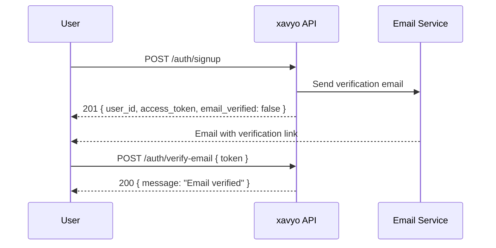
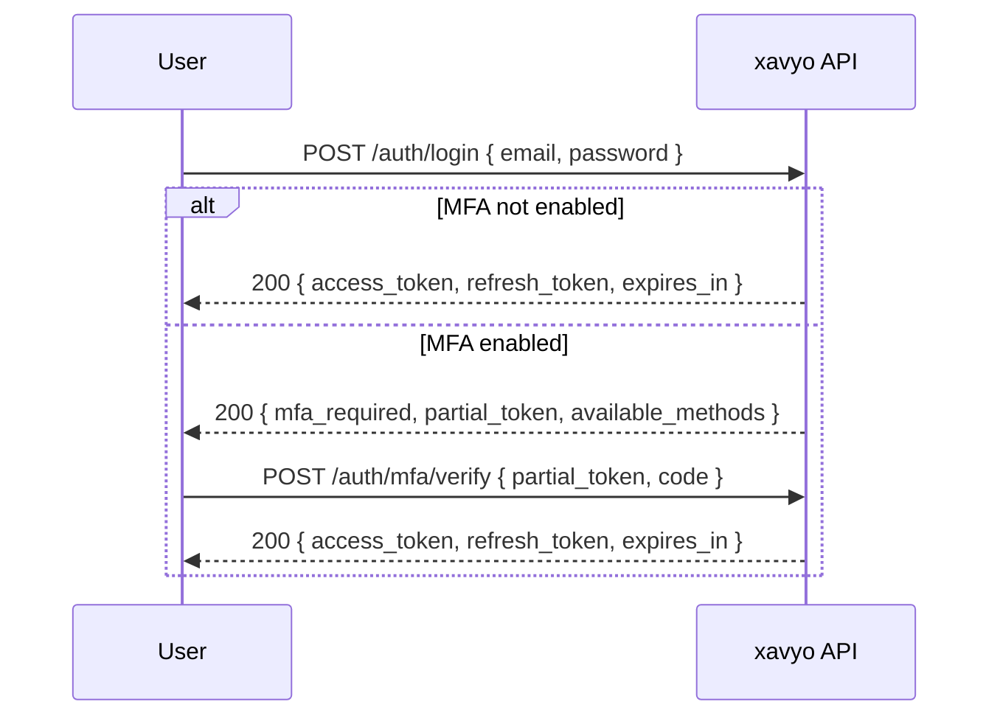
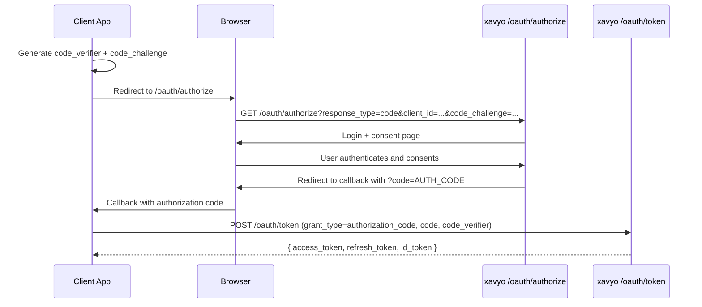
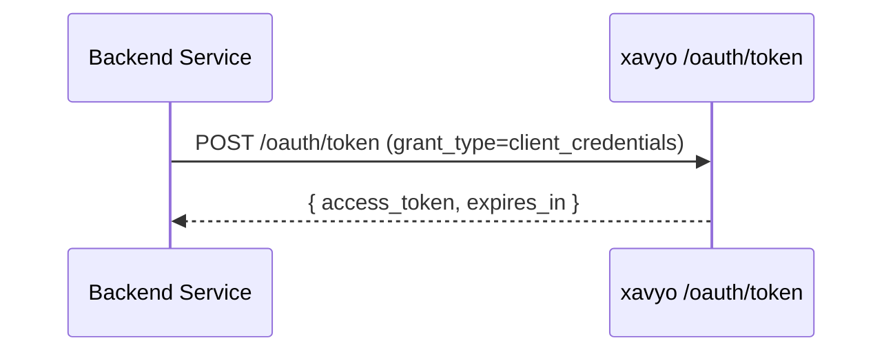
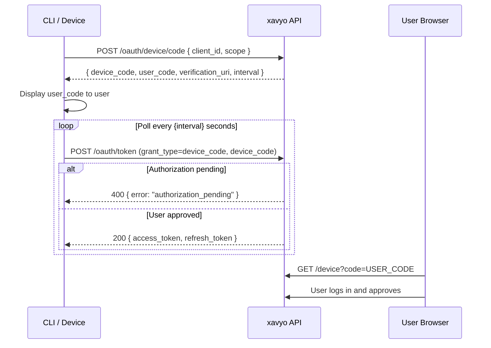
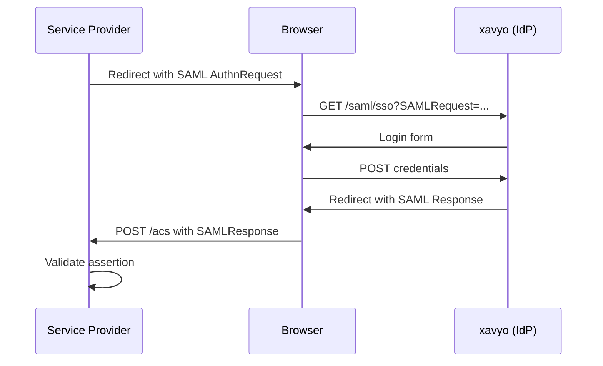
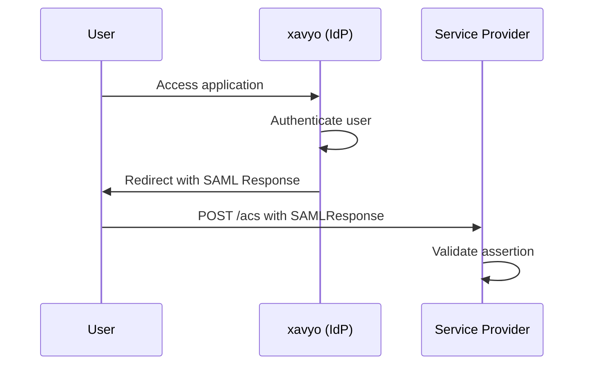
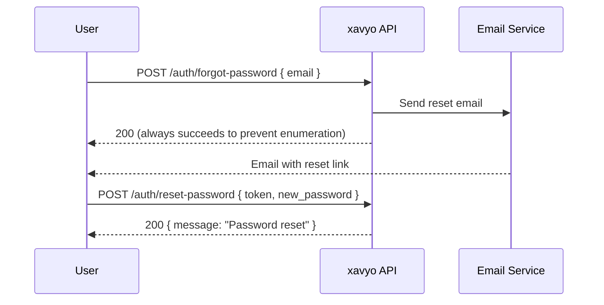

# Authentication Flows

This guide covers every authentication flow supported by xavyo, with sequence diagrams, curl examples, and integration advice.

## User Signup and Email Verification

New users self-register via the signup endpoint. A verification email is sent automatically.



### Signup

```bash
curl -X POST https://idp.example.com/auth/signup \
  -H "Content-Type: application/json" \
  -H "X-Tenant-ID: 550e8400-e29b-41d4-a716-446655440000" \
  -d '{
    "email": "alice@example.com",
    "password": "SecureP@ss123",
    "display_name": "Alice Smith"
  }'
```

**Response (201 Created):**

```json
{
  "user_id": "f47ac10b-58cc-4372-a567-0e02b2c3d479",
  "email": "alice@example.com",
  "access_token": "eyJhbGciOiJSUzI1NiIs...",
  "email_verified": false,
  "expires_in": 3600
}
```

**Password requirements:**
- Minimum 8 characters
- At least one uppercase letter (A-Z)
- At least one lowercase letter (a-z)
- At least one digit (0-9)
- Display name: optional, max 255 characters, no control characters

### Email Verification

Extract the token from the verification email link and submit it:

```bash
curl -X POST https://idp.example.com/auth/verify-email \
  -H "Content-Type: application/json" \
  -H "X-Tenant-ID: 550e8400-e29b-41d4-a716-446655440000" \
  -d '{"token": "abc123def456..."}'
```

:::warning
Users cannot log in until their email is verified. The verification token expires after 24 hours.
:::

## Login Flow

Login authenticates with email and password. If MFA is enabled, a partial token is returned that must be completed with a second factor.



### Standard Login (no MFA)

```bash
curl -X POST https://idp.example.com/auth/login \
  -H "Content-Type: application/json" \
  -H "X-Tenant-ID: 550e8400-e29b-41d4-a716-446655440000" \
  -d '{
    "email": "alice@example.com",
    "password": "SecureP@ss123"
  }'
```

**Response (200 OK):**

```json
{
  "access_token": "eyJhbGciOiJSUzI1NiIs...",
  "refresh_token": "dGhpcyBpcyBhIHJlZnJl...",
  "token_type": "Bearer",
  "expires_in": 3600
}
```

### Login with MFA

When MFA is enabled, the login response indicates available methods:

```json
{
  "mfa_required": true,
  "partial_token": "eyJhbGciOiJSUzI1NiIs...",
  "expires_in": 300,
  "available_methods": ["totp", "webauthn", "recovery"]
}
```

Complete MFA verification with a TOTP code:

```bash
curl -X POST https://idp.example.com/auth/mfa/verify \
  -H "Content-Type: application/json" \
  -H "X-Tenant-ID: 550e8400-e29b-41d4-a716-446655440000" \
  -d '{
    "partial_token": "eyJhbGciOiJSUzI1NiIs...",
    "code": "123456"
  }'
```

:::info
The partial token expires in 5 minutes. If the user does not complete MFA within this window, they must log in again.
:::

### Account Lockout

After 5 consecutive failed login attempts, the account is temporarily locked. The lockout response includes the unlock time:

```json
{
  "type": "https://xavyo.net/errors/account-locked",
  "title": "Account Locked",
  "status": 401,
  "detail": "Your account has been locked until 2026-02-07T16:00:00Z."
}
```

## OAuth 2.0 Authorization Code Flow (with PKCE)

The authorization code flow with PKCE is the recommended flow for web applications, mobile apps, and single-page applications.



### Step 1: Generate PKCE Challenge

```javascript
// Generate code_verifier (43-128 characters, URL-safe)
const codeVerifier = generateRandomString(64);

// Create code_challenge = BASE64URL(SHA256(code_verifier))
const encoder = new TextEncoder();
const data = encoder.encode(codeVerifier);
const digest = await crypto.subtle.digest('SHA-256', data);
const codeChallenge = base64UrlEncode(digest);
```

### Step 2: Redirect to Authorization Endpoint

```
https://idp.example.com/oauth/authorize?
  response_type=code&
  client_id=my-app&
  redirect_uri=https://app.example.com/callback&
  scope=openid profile email&
  state=random-state-value&
  code_challenge=E9Melhoa2OwvFrEMTJguCHaoeK1t8URWbuGJSstw-cM&
  code_challenge_method=S256&
  nonce=random-nonce-value
```

### Step 3: Exchange Code for Tokens

```bash
curl -X POST https://idp.example.com/oauth/token \
  -H "Content-Type: application/x-www-form-urlencoded" \
  -d 'grant_type=authorization_code' \
  -d 'code=AUTH_CODE_FROM_CALLBACK' \
  -d 'redirect_uri=https://app.example.com/callback' \
  -d 'client_id=my-app' \
  -d 'code_verifier=the-original-code-verifier'
```

**Response (200 OK):**

```json
{
  "access_token": "eyJhbGciOiJSUzI1NiIs...",
  "token_type": "Bearer",
  "expires_in": 3600,
  "refresh_token": "dGhpcyBpcyBhIHJlZnJl...",
  "id_token": "eyJhbGciOiJSUzI1NiIs...",
  "scope": "openid profile email"
}
```

:::tip
The `code_verifier` is required (PKCE is mandatory). xavyo only supports `S256` as the code challenge method.
:::

## OAuth 2.0 Client Credentials Flow

For service-to-service authentication without a user context. Only confidential clients (those with a `client_secret`) can use this flow.



```bash
curl -X POST https://idp.example.com/oauth/token \
  -H "Content-Type: application/x-www-form-urlencoded" \
  -H "X-Tenant-ID: 550e8400-e29b-41d4-a716-446655440000" \
  -u "my-service-client:my-client-secret" \
  -d 'grant_type=client_credentials' \
  -d 'scope=users:read groups:read'
```

**Response (200 OK):**

```json
{
  "access_token": "eyJhbGciOiJSUzI1NiIs...",
  "token_type": "Bearer",
  "expires_in": 3600,
  "scope": "users:read groups:read"
}
```

:::tip
Client credentials tokens do not include a `refresh_token` or `id_token`. Request a new access token when the current one expires.
:::

## OAuth 2.0 Device Code Flow (RFC 8628)

The device code flow enables authentication on input-constrained devices (CLI tools, IoT devices, smart TVs). xavyo includes Storm-2372 protections against device code phishing.



### Step 1: Request Device Authorization

```bash
curl -X POST https://idp.example.com/oauth/device/code \
  -H "Content-Type: application/x-www-form-urlencoded" \
  -H "X-Tenant-ID: 550e8400-e29b-41d4-a716-446655440000" \
  -d 'client_id=cli-app' \
  -d 'scope=openid profile'
```

**Response (200 OK):**

```json
{
  "device_code": "GmRhmhcxhwAzkoEqiMEg_DnyEysNkuNhszIySk9eS",
  "user_code": "WDJB-MJHT",
  "verification_uri": "https://idp.example.com/device",
  "verification_uri_complete": "https://idp.example.com/device?code=WDJB-MJHT",
  "expires_in": 600,
  "interval": 5
}
```

Display the `user_code` and `verification_uri` to the user.

### Step 2: Poll for Token

```bash
curl -X POST https://idp.example.com/oauth/token \
  -H "Content-Type: application/x-www-form-urlencoded" \
  -H "X-Tenant-ID: 550e8400-e29b-41d4-a716-446655440000" \
  -d 'grant_type=urn:ietf:params:oauth:grant-type:device_code' \
  -d 'device_code=GmRhmhcxhwAzkoEqiMEg_DnyEysNkuNhszIySk9eS' \
  -d 'client_id=cli-app'
```

**While pending:** `400 { "error": "authorization_pending" }`
**On slow-down:** `400 { "error": "slow_down" }` -- increase poll interval
**On approval:** `200 { "access_token": "...", "refresh_token": "..." }`
**On denial:** `400 { "error": "access_denied" }`
**On expiry:** `400 { "error": "expired_token" }`

:::danger
**Storm-2372 Protections**: xavyo displays the origin IP, requesting application name, and request age on the approval page. Users see warnings for unknown applications, stale requests (older than 5 minutes), and IP mismatches between the device and the approver. High-risk approvals require email confirmation before the authorization is completed.
:::

## OIDC Discovery

xavyo publishes a standard OpenID Connect Discovery document:

```bash
curl https://idp.example.com/.well-known/openid-configuration
```

**Key fields in the response:**

```json
{
  "issuer": "https://idp.example.com",
  "authorization_endpoint": "https://idp.example.com/oauth/authorize",
  "token_endpoint": "https://idp.example.com/oauth/token",
  "userinfo_endpoint": "https://idp.example.com/oauth/userinfo",
  "jwks_uri": "https://idp.example.com/.well-known/jwks.json",
  "device_authorization_endpoint": "https://idp.example.com/oauth/device/code",
  "response_types_supported": ["code"],
  "grant_types_supported": [
    "authorization_code", "client_credentials", "refresh_token",
    "urn:ietf:params:oauth:grant-type:device_code"
  ],
  "scopes_supported": ["openid", "profile", "email", "offline_access"],
  "id_token_signing_alg_values_supported": ["RS256"],
  "code_challenge_methods_supported": ["S256"],
  "claims_supported": ["sub", "iss", "aud", "exp", "iat", "name", "email", "email_verified"]
}
```

### JWKS Endpoint

Retrieve the JSON Web Key Set for token signature verification:

```bash
curl https://idp.example.com/.well-known/jwks.json
```

```json
{
  "keys": [
    {
      "kty": "RSA",
      "kid": "key-2026-01",
      "use": "sig",
      "alg": "RS256",
      "n": "0vx7agoebGc...",
      "e": "AQAB"
    }
  ]
}
```

:::tip
Cache the JWKS response and refresh it periodically (e.g., every hour) or when you encounter a `kid` you do not recognize. xavyo supports multiple signing keys for seamless key rotation.
:::

## SAML Flows

xavyo functions as a SAML Identity Provider (IdP) and can federate with external SAML IdPs.

### SP-Initiated Flow



### IdP-Initiated Flow



## Token Lifecycle

### Token Types

| Token | Format | Lifetime | Purpose |
|-------|--------|----------|---------|
| Access Token | JWT (RS256) | 1 hour | API authorization |
| Refresh Token | Opaque | 30 days | Obtain new access tokens |
| ID Token | JWT (RS256) | 1 hour | User identity claims (OIDC) |
| Partial Token | JWT | 5 minutes | MFA verification session |

### Refresh Tokens

Exchange a refresh token for a new access token:

```bash
curl -X POST https://idp.example.com/oauth/token \
  -H "Content-Type: application/x-www-form-urlencoded" \
  -H "X-Tenant-ID: 550e8400-e29b-41d4-a716-446655440000" \
  -d 'grant_type=refresh_token' \
  -d 'refresh_token=dGhpcyBpcyBhIHJlZnJl...' \
  -d 'client_id=my-app'
```

:::warning
**Refresh token rotation**: Each refresh exchanges the old token for a new one. The old token is invalidated. If a previously-rotated token is reused (indicating theft), the entire token family is revoked for security.
:::

### Token Revocation

Revoke a specific token:

```bash
curl -X POST https://idp.example.com/oauth/revoke \
  -H "Content-Type: application/x-www-form-urlencoded" \
  -u "my-app:my-secret" \
  -d 'token=eyJhbGciOiJSUzI1NiIs...' \
  -d 'token_type_hint=access_token'
```

### Token Introspection (RFC 7662)

Check whether a token is active:

```bash
curl -X POST https://idp.example.com/oauth/introspect \
  -H "Content-Type: application/x-www-form-urlencoded" \
  -H "X-Tenant-ID: 550e8400-e29b-41d4-a716-446655440000" \
  -u "my-app:my-secret" \
  -d 'token=eyJhbGciOiJSUzI1NiIs...'
```

**Active token response:**

```json
{
  "active": true,
  "sub": "f47ac10b-58cc-4372-a567-0e02b2c3d479",
  "client_id": "my-app",
  "scope": "openid profile email",
  "token_type": "Bearer",
  "exp": 1707321600,
  "iat": 1707318000,
  "iss": "https://idp.example.com",
  "jti": "a1b2c3d4-e5f6-7890-abcd-ef1234567890",
  "tid": "550e8400-e29b-41d4-a716-446655440000"
}
```

**Inactive token response:** `{ "active": false }`

## Session Management

### List Active Sessions

```bash
curl https://idp.example.com/me/sessions \
  -H "Authorization: Bearer $TOKEN"
```

### Revoke a Session

```bash
curl -X DELETE https://idp.example.com/me/sessions/{session_id} \
  -H "Authorization: Bearer $TOKEN"
```

### Logout

```bash
curl -X POST https://idp.example.com/auth/logout \
  -H "Authorization: Bearer $TOKEN"
```

## Password Reset Flow



```bash
# Request reset
curl -X POST https://idp.example.com/auth/forgot-password \
  -H "Content-Type: application/json" \
  -H "X-Tenant-ID: 550e8400-e29b-41d4-a716-446655440000" \
  -d '{"email": "alice@example.com"}'

# Reset password with token from email
curl -X POST https://idp.example.com/auth/reset-password \
  -H "Content-Type: application/json" \
  -H "X-Tenant-ID: 550e8400-e29b-41d4-a716-446655440000" \
  -d '{
    "token": "reset-token-from-email",
    "new_password": "NewSecureP@ss456"
  }'
```

:::info
The forgot-password endpoint always returns `200 OK` regardless of whether the email exists. This prevents email enumeration attacks.
:::
