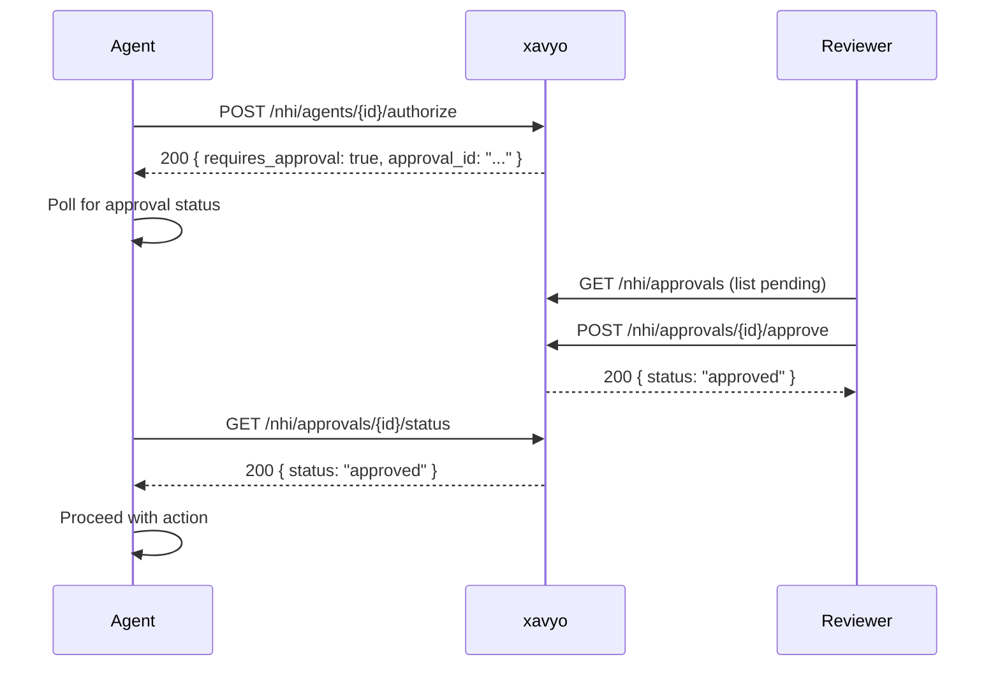

# Non-Human Identities (NHI)

xavyo provides a unified API for managing Non-Human Identities (NHI) -- the machine accounts, AI agents, and automated tools that interact with your systems. The NHI API consolidates service account management, AI agent governance, tool registration, credential lifecycle, risk assessment, and human-in-the-loop (HITL) approval workflows into a single namespace.

## Overview

Non-Human Identities fall into three categories:

| Category | Description | Use Case |
|----------|-------------|----------|
| **Service Accounts** | Long-lived machine identities for automated processes | CI/CD pipelines, background jobs, integrations |
| **AI Agents** | Autonomous software agents with security boundaries | LLM-powered assistants, automation bots, copilots |
| **Tools** | Registered capabilities that agents can invoke | Database queries, API calls, file operations |

All NHI resources are tenant-scoped and require JWT authentication. Mutation operations (create, update, delete) require the `admin` role.

## Service Accounts

Service accounts are traditional machine identities for automated processes that need to authenticate with xavyo-protected resources.

### Create a Service Account

```bash
curl -X POST https://idp.example.com/nhi/service-accounts \
  -H "Authorization: Bearer $ADMIN_TOKEN" \
  -H "Content-Type: application/json" \
  -d '{
    "name": "ci-pipeline-prod",
    "description": "Production CI/CD pipeline service account",
    "owner_id": "f47ac10b-58cc-4372-a567-0e02b2c3d479",
    "nhi_type": "service_account",
    "risk_level": "medium"
  }'
```

**Response (201 Created):**

```json
{
  "id": "a1b2c3d4-5678-90ab-cdef-1234567890ab",
  "tenant_id": "550e8400-e29b-41d4-a716-446655440000",
  "name": "ci-pipeline-prod",
  "description": "Production CI/CD pipeline service account",
  "nhi_type": "service_account",
  "owner_id": "f47ac10b-58cc-4372-a567-0e02b2c3d479",
  "status": "active",
  "risk_level": "medium",
  "created_at": "2026-02-07T10:00:00Z",
  "updated_at": "2026-02-07T10:00:00Z"
}
```

### List Service Accounts

```bash
curl "https://idp.example.com/nhi/service-accounts?limit=20&offset=0" \
  -H "Authorization: Bearer $ADMIN_TOKEN"
```

Filter by status or search by name:

```bash
curl "https://idp.example.com/nhi/service-accounts?status=active&search=ci-pipeline" \
  -H "Authorization: Bearer $ADMIN_TOKEN"
```

### Get Summary Statistics

```bash
curl https://idp.example.com/nhi/service-accounts/summary \
  -H "Authorization: Bearer $ADMIN_TOKEN"
```

Returns aggregate counts of service accounts by status and risk level.

### Update a Service Account

```bash
curl -X PUT https://idp.example.com/nhi/service-accounts/{id} \
  -H "Authorization: Bearer $ADMIN_TOKEN" \
  -H "Content-Type: application/json" \
  -d '{
    "description": "Updated description",
    "risk_level": "high"
  }'
```

### Suspend and Reactivate

Suspend a service account to immediately revoke access without deleting it:

```bash
# Suspend
curl -X POST https://idp.example.com/nhi/service-accounts/{id}/suspend \
  -H "Authorization: Bearer $ADMIN_TOKEN" \
  -H "Content-Type: application/json" \
  -d '{
    "reason": "Credential compromise suspected"
  }'

# Reactivate
curl -X POST https://idp.example.com/nhi/service-accounts/{id}/reactivate \
  -H "Authorization: Bearer $ADMIN_TOKEN" \
  -H "Content-Type: application/json" \
  -d '{
    "reason": "Investigation complete, no compromise found"
  }'
```

### Transfer Ownership

Transfer a service account to a new owner:

```bash
curl -X POST https://idp.example.com/nhi/service-accounts/{id}/transfer \
  -H "Authorization: Bearer $ADMIN_TOKEN" \
  -H "Content-Type: application/json" \
  -d '{
    "new_owner_id": "b2c3d4e5-6789-0abc-def1-234567890abc"
  }'
```

### Delete a Service Account

```bash
curl -X DELETE https://idp.example.com/nhi/service-accounts/{id} \
  -H "Authorization: Bearer $ADMIN_TOKEN"
```

**Response:** `204 No Content`

## AI Agents

AI agents are autonomous software entities that operate within defined security boundaries. xavyo provides governance controls including permission management, behavioral anomaly detection, and human-in-the-loop approval gates.

### Register an Agent

```bash
curl -X POST https://idp.example.com/nhi/agents \
  -H "Authorization: Bearer $ADMIN_TOKEN" \
  -H "Content-Type: application/json" \
  -d '{
    "name": "data-analyst-bot",
    "description": "Automated data analysis agent",
    "model": "claude-opus-4-6",
    "owner_id": "f47ac10b-58cc-4372-a567-0e02b2c3d479",
    "risk_level": "medium",
    "max_actions_per_minute": 30
  }'
```

### List Agents

```bash
curl "https://idp.example.com/nhi/agents?limit=20&offset=0" \
  -H "Authorization: Bearer $ADMIN_TOKEN"
```

### Get Agent Details

```bash
curl https://idp.example.com/nhi/agents/{id} \
  -H "Authorization: Bearer $ADMIN_TOKEN"
```

### Update an Agent

```bash
curl -X PATCH https://idp.example.com/nhi/agents/{id} \
  -H "Authorization: Bearer $ADMIN_TOKEN" \
  -H "Content-Type: application/json" \
  -d '{
    "description": "Updated agent description",
    "max_actions_per_minute": 50
  }'
```

### Agent Permissions

Grant and manage fine-grained permissions for what an agent can access:

```bash
# Grant a permission
curl -X POST https://idp.example.com/nhi/agents/{id}/permissions \
  -H "Authorization: Bearer $ADMIN_TOKEN" \
  -H "Content-Type: application/json" \
  -d '{
    "resource": "database:analytics",
    "action": "read",
    "conditions": {
      "time_window": "09:00-17:00",
      "max_rows": 10000
    }
  }'

# List permissions
curl "https://idp.example.com/nhi/agents/{id}/permissions" \
  -H "Authorization: Bearer $ADMIN_TOKEN"
```

### Authorization Check

Before an agent performs an action, check whether it is authorized:

```bash
curl -X POST https://idp.example.com/nhi/agents/{id}/authorize \
  -H "Authorization: Bearer $ADMIN_TOKEN" \
  -H "Content-Type: application/json" \
  -d '{
    "resource": "database:analytics",
    "action": "read"
  }'
```

**Response:**

```json
{
  "authorized": true,
  "requires_approval": false,
  "reason": "Permission granted via direct assignment"
}
```

### Security Assessment

Get a comprehensive security assessment for an agent:

```bash
curl https://idp.example.com/nhi/agents/{id}/security-assessment \
  -H "Authorization: Bearer $ADMIN_TOKEN"
```

Returns risk scores, permission analysis, anomaly indicators, and recommendations.

### Anomaly Detection

xavyo monitors agent behavior against established baselines:

```bash
# Get baseline behavior profile
curl https://idp.example.com/nhi/agents/{id}/baseline \
  -H "Authorization: Bearer $ADMIN_TOKEN"

# List detected anomalies
curl "https://idp.example.com/nhi/agents/{id}/anomalies?limit=20" \
  -H "Authorization: Bearer $ADMIN_TOKEN"

# Configure detection thresholds
curl -X PUT https://idp.example.com/nhi/agents/{id}/thresholds \
  -H "Authorization: Bearer $ADMIN_TOKEN" \
  -H "Content-Type: application/json" \
  -d '{
    "action_rate_threshold": 100,
    "error_rate_threshold": 0.1,
    "unusual_resource_threshold": 0.05
  }'
```

When an anomaly is detected, xavyo emits an `agent.anomaly.detected` webhook event.

### Audit Trail

Every agent action is logged for compliance:

```bash
curl "https://idp.example.com/nhi/agents/{id}/audit?limit=50" \
  -H "Authorization: Bearer $ADMIN_TOKEN"
```

## Tools

Tools represent capabilities that agents can invoke. Registering tools gives administrators visibility into what actions are available and allows policy enforcement.

### Register a Tool

```bash
curl -X POST https://idp.example.com/nhi/tools \
  -H "Authorization: Bearer $ADMIN_TOKEN" \
  -H "Content-Type: application/json" \
  -d '{
    "name": "sql-query",
    "description": "Execute read-only SQL queries against the analytics database",
    "category": "database",
    "risk_level": "medium",
    "requires_approval": true,
    "parameters_schema": {
      "type": "object",
      "properties": {
        "query": {"type": "string"},
        "database": {"type": "string", "enum": ["analytics", "reporting"]}
      },
      "required": ["query", "database"]
    }
  }'
```

### List Tools

```bash
curl "https://idp.example.com/nhi/tools?limit=20&offset=0" \
  -H "Authorization: Bearer $ADMIN_TOKEN"
```

Filter by category, risk level, or approval requirement:

```bash
curl "https://idp.example.com/nhi/tools?category=database&requires_approval=true" \
  -H "Authorization: Bearer $ADMIN_TOKEN"
```

### Update a Tool

```bash
curl -X PATCH https://idp.example.com/nhi/tools/{id} \
  -H "Authorization: Bearer $ADMIN_TOKEN" \
  -H "Content-Type: application/json" \
  -d '{
    "requires_approval": false,
    "risk_level": "low"
  }'
```

### Delete a Tool

```bash
curl -X DELETE https://idp.example.com/nhi/tools/{id} \
  -H "Authorization: Bearer $ADMIN_TOKEN"
```

## Human-in-the-Loop (HITL) Approvals

When an agent attempts to invoke a tool marked with `requires_approval: true`, xavyo creates a pending approval request. A human reviewer must approve or deny the action before the agent can proceed.

### Approval Flow



### List Pending Approvals

```bash
curl "https://idp.example.com/nhi/approvals?status=pending&limit=20" \
  -H "Authorization: Bearer $ADMIN_TOKEN"
```

### Approve a Request

```bash
curl -X POST https://idp.example.com/nhi/approvals/{id}/approve \
  -H "Authorization: Bearer $ADMIN_TOKEN" \
  -H "Content-Type: application/json" \
  -d '{
    "reason": "Action is within acceptable parameters",
    "conditions": {
      "max_rows": 1000,
      "expires_in_minutes": 30
    }
  }'
```

### Deny a Request

```bash
curl -X POST https://idp.example.com/nhi/approvals/{id}/deny \
  -H "Authorization: Bearer $ADMIN_TOKEN" \
  -H "Content-Type: application/json" \
  -d '{
    "reason": "Query scope is too broad, please narrow the WHERE clause"
  }'
```

### Check Approval Status

Agents can poll for approval decisions:

```bash
curl https://idp.example.com/nhi/approvals/{id}/status \
  -H "Authorization: Bearer $ADMIN_TOKEN"
```

**Response:**

```json
{
  "id": "a1b2c3d4-...",
  "status": "approved",
  "decided_by": "f47ac10b-...",
  "decided_at": "2026-02-07T15:32:00Z",
  "conditions": {
    "max_rows": 1000,
    "expires_in_minutes": 30
  }
}
```

## Risk Assessment

xavyo provides risk visibility across all NHI types.

### Risk Summary

Get aggregated risk statistics across all service accounts and agents:

```bash
curl https://idp.example.com/nhi/risk-summary \
  -H "Authorization: Bearer $ADMIN_TOKEN"
```

**Response:**

```json
{
  "total_count": 47,
  "by_type": {
    "service_account": 35,
    "ai_agent": 12
  },
  "by_risk_level": {
    "critical": 2,
    "high": 8,
    "medium": 22,
    "low": 15
  },
  "pending_certification": 5,
  "inactive_30_days": 3,
  "expiring_7_days": 1
}
```

### Staleness Report

Identify inactive NHIs that may be candidates for decommissioning:

```bash
curl "https://idp.example.com/nhi/staleness-report?inactive_days=30" \
  -H "Authorization: Bearer $ADMIN_TOKEN"
```

## Certification Campaigns

Certification campaigns enable periodic review of all NHI access to ensure compliance and least-privilege adherence.

### Create a Campaign

```bash
curl -X POST https://idp.example.com/nhi/certifications \
  -H "Authorization: Bearer $ADMIN_TOKEN" \
  -H "Content-Type: application/json" \
  -d '{
    "name": "Q1 2026 NHI Review",
    "description": "Quarterly review of all service accounts and agents",
    "nhi_types": ["service_account", "ai_agent"],
    "reviewer_id": "f47ac10b-58cc-4372-a567-0e02b2c3d479",
    "due_date": "2026-03-31T23:59:59Z",
    "filter": {
      "risk_min": 3,
      "inactive_days": 30
    }
  }'
```

### Campaign Lifecycle

1. **Draft** -- Campaign created, items not yet populated
2. **Active** -- Campaign launched, reviewer can certify or revoke items
3. **Completed** -- All items reviewed or campaign closed
4. **Cancelled** -- Campaign abandoned

### Certify or Revoke Items

For each NHI in the campaign, the reviewer decides to certify (keep) or revoke (decommission):

```bash
# Certify an item
curl -X POST https://idp.example.com/nhi/certifications/{campaign_id}/items/{item_id}/decide \
  -H "Authorization: Bearer $ADMIN_TOKEN" \
  -H "Content-Type: application/json" \
  -d '{
    "decision": "certify",
    "comment": "Still in active use for production deployments"
  }'

# Revoke an item
curl -X POST https://idp.example.com/nhi/certifications/{campaign_id}/items/{item_id}/decide \
  -H "Authorization: Bearer $ADMIN_TOKEN" \
  -H "Content-Type: application/json" \
  -d '{
    "decision": "revoke",
    "comment": "No longer needed, project decommissioned"
  }'
```

### Bulk Decisions

Process multiple items at once:

```bash
curl -X POST https://idp.example.com/nhi/certifications/{campaign_id}/items/bulk-decide \
  -H "Authorization: Bearer $ADMIN_TOKEN" \
  -H "Content-Type: application/json" \
  -d '{
    "decisions": [
      {"item_id": "id-1", "decision": "certify", "comment": "Active"},
      {"item_id": "id-2", "decision": "revoke", "comment": "Decommission"}
    ]
  }'
```

## Best Practices

1. **Assign owners to all NHIs** -- Every service account and agent should have a human owner responsible for its lifecycle
2. **Use least-privilege permissions** -- Grant only the minimum permissions needed for each agent or service account
3. **Rotate credentials regularly** -- Set credential expiration dates and monitor the staleness report for inactive identities
4. **Require HITL for high-risk tools** -- Mark destructive or sensitive tools with `requires_approval: true`
5. **Run quarterly certification campaigns** -- Regularly review all NHI access with structured campaigns
6. **Monitor anomaly detection** -- Subscribe to `agent.anomaly.detected` webhook events and investigate deviations promptly
7. **Suspend before deleting** -- When investigating potential compromise, suspend the identity first to preserve audit trails
