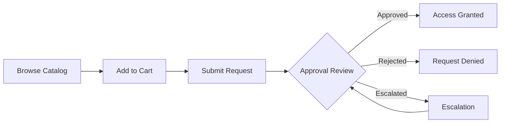

# Access Requests

xavyo provides a self-service access request system that lets users browse available roles and entitlements, add them to a request cart, and submit requests for approval. Administrators and designated approvers review requests and grant or deny access.

## How It Works



1. **Browse** the service catalog to find roles, entitlements, or resources you need
2. **Add items** to your request cart with justifications
3. **Submit** the cart to create access requests for each item
4. **Approvers** review your request and approve or reject it
5. **Access is provisioned** automatically upon approval

## Browsing the Catalog

The service catalog lists all roles, entitlements, and resources available for request within your tenant.

### List Catalog Items

```bash
curl "https://idp.example.com/governance/catalog/items?limit=20&offset=0" \
  -H "Authorization: Bearer $TOKEN"
```

**Response (200 OK):**

```json
{
  "items": [
    {
      "id": "a1b2c3d4-5678-90ab-cdef-1234567890ab",
      "name": "Database Read Access",
      "description": "Read-only access to the analytics database",
      "category": "Database",
      "item_type": "entitlement",
      "risk_level": "low",
      "approval_required": true,
      "enabled": true,
      "metadata": {
        "department": "Engineering",
        "data_classification": "internal"
      }
    }
  ],
  "total": 42,
  "limit": 20,
  "offset": 0
}
```

### Filter and Search

Filter catalog items by category, type, or search term:

```bash
# Filter by category
curl "https://idp.example.com/governance/catalog/items?category=Database" \
  -H "Authorization: Bearer $TOKEN"

# Filter by item type
curl "https://idp.example.com/governance/catalog/items?item_type=role" \
  -H "Authorization: Bearer $TOKEN"
```

### Get Item Details

View full details for a specific catalog item:

```bash
curl https://idp.example.com/governance/catalog/items/{id} \
  -H "Authorization: Bearer $TOKEN"
```

## Request Cart

The request cart lets you collect multiple items before submitting them as a batch. Each item in the cart can have its own justification.

### Add an Item to Your Cart

```bash
curl -X POST https://idp.example.com/governance/catalog/cart/items \
  -H "Authorization: Bearer $TOKEN" \
  -H "Content-Type: application/json" \
  -d '{
    "catalog_item_id": "a1b2c3d4-5678-90ab-cdef-1234567890ab",
    "justification": "Need database access for the Q1 analytics project",
    "beneficiary_id": null
  }'
```

Set `beneficiary_id` to request access on behalf of another user (requires appropriate permissions). Leave it `null` to request for yourself.

### View Your Cart

```bash
curl https://idp.example.com/governance/catalog/cart \
  -H "Authorization: Bearer $TOKEN"
```

**Response (200 OK):**

```json
{
  "id": "cart-uuid",
  "items": [
    {
      "id": "cart-item-uuid",
      "catalog_item_id": "a1b2c3d4-...",
      "catalog_item_name": "Database Read Access",
      "justification": "Need database access for the Q1 analytics project",
      "added_at": "2026-02-07T10:00:00Z"
    }
  ],
  "total_items": 1
}
```

### Update a Cart Item

Change the justification for an item in your cart:

```bash
curl -X PUT https://idp.example.com/governance/catalog/cart/items/{item_id} \
  -H "Authorization: Bearer $TOKEN" \
  -H "Content-Type: application/json" \
  -d '{
    "justification": "Updated justification with more detail"
  }'
```

### Remove an Item from Your Cart

```bash
curl -X DELETE https://idp.example.com/governance/catalog/cart/items/{item_id} \
  -H "Authorization: Bearer $TOKEN"
```

### Submit Your Cart

Submit all cart items as access requests:

```bash
curl -X POST https://idp.example.com/governance/catalog/cart/submit \
  -H "Authorization: Bearer $TOKEN" \
  -H "Content-Type: application/json" \
  -d '{
    "global_justification": "Q1 analytics project setup"
  }'
```

**Response (201 Created):**

```json
{
  "requests_created": 1,
  "request_ids": ["req-uuid-1"],
  "message": "Access requests submitted successfully"
}
```

The `global_justification` is appended to each item's individual justification. One access request is created per catalog item in the cart.

## Direct Access Requests

You can also create individual access requests without using the cart:

```bash
curl -X POST https://idp.example.com/governance/access-requests \
  -H "Authorization: Bearer $TOKEN" \
  -H "Content-Type: application/json" \
  -d '{
    "entitlement_id": "a1b2c3d4-5678-90ab-cdef-1234567890ab",
    "justification": "Required for production deployment pipeline",
    "requested_duration": "30d"
  }'
```

**Response (201 Created):**

```json
{
  "id": "b2c3d4e5-6789-0abc-def1-234567890abc",
  "status": "pending",
  "entitlement_id": "a1b2c3d4-...",
  "requester_id": "f47ac10b-...",
  "justification": "Required for production deployment pipeline",
  "created_at": "2026-02-07T10:30:00Z"
}
```

## Tracking Your Requests

### List Your Requests

```bash
curl "https://idp.example.com/governance/access-requests?limit=20&offset=0" \
  -H "Authorization: Bearer $TOKEN"
```

Filter by status to see only pending, approved, or rejected requests:

```bash
# Only pending requests
curl "https://idp.example.com/governance/access-requests?status=pending" \
  -H "Authorization: Bearer $TOKEN"

# Only approved requests
curl "https://idp.example.com/governance/access-requests?status=approved" \
  -H "Authorization: Bearer $TOKEN"
```

### Request Statuses

| Status | Description |
|--------|-------------|
| `pending` | Waiting for approver review |
| `approved` | Approved by all required approvers |
| `rejected` | Rejected by an approver |
| `cancelled` | Cancelled by the requester |
| `expired` | Request expired before a decision was made |
| `provisioning` | Approved and being provisioned |
| `provisioned` | Access has been granted |
| `failed` | Provisioning failed |

### Get Request Details

```bash
curl https://idp.example.com/governance/access-requests/{id} \
  -H "Authorization: Bearer $TOKEN"
```

Returns the full request details including approval history and any comments.

### Cancel a Request

Cancel a pending request that has not yet been decided:

```bash
curl -X POST https://idp.example.com/governance/access-requests/{id}/cancel \
  -H "Authorization: Bearer $TOKEN"
```

:::info
You can only cancel requests that are still in `pending` status. Once a request has been approved or rejected, it cannot be cancelled.
:::

## Approval Workflow

### For Approvers

If you are designated as an approver, you can review and act on access requests.

#### Approve a Request

```bash
curl -X POST https://idp.example.com/governance/access-requests/{id}/approve \
  -H "Authorization: Bearer $TOKEN" \
  -H "Content-Type: application/json" \
  -d '{
    "comments": "Approved for the Q1 project duration"
  }'
```

#### Reject a Request

```bash
curl -X POST https://idp.example.com/governance/access-requests/{id}/reject \
  -H "Authorization: Bearer $TOKEN" \
  -H "Content-Type: application/json" \
  -d '{
    "comments": "This role provides more access than needed. Please request the read-only variant instead."
  }'
```

### Escalation

If a request has not been reviewed within the configured timeout period, xavyo automatically escalates it to the next level approver. You can view the escalation history:

```bash
curl https://idp.example.com/governance/access-requests/{id}/escalation-history \
  -H "Authorization: Bearer $TOKEN"
```

## Webhook Notifications

xavyo emits webhook events for access request lifecycle changes:

| Event Type | When Emitted |
|------------|-------------|
| `access_request.created` | A new access request is submitted |
| `access_request.approved` | An access request is approved |
| `access_request.denied` | An access request is rejected |

Subscribe to these events through the [Webhooks API](/docs/guides/developer/webhooks) to trigger workflows in your ticketing system, Slack, or other tools.

## Best Practices

1. **Write clear justifications** -- Explain why you need the access and what project or task requires it. This helps approvers make faster decisions.
2. **Request minimum necessary access** -- Choose the most restrictive role or entitlement that meets your needs. This follows the principle of least privilege.
3. **Set time-bound access** -- If you only need access temporarily, specify a `requested_duration` so the access is automatically revoked when no longer needed.
4. **Use the cart for batch requests** -- When you need multiple related items, use the cart to submit them together with a unified justification.
5. **Monitor your pending requests** -- Check request status regularly. If a request is taking too long, it may need escalation or additional justification.
6. **Cancel unneeded requests** -- If your requirements change, cancel pending requests promptly to avoid unnecessary approver workload.
