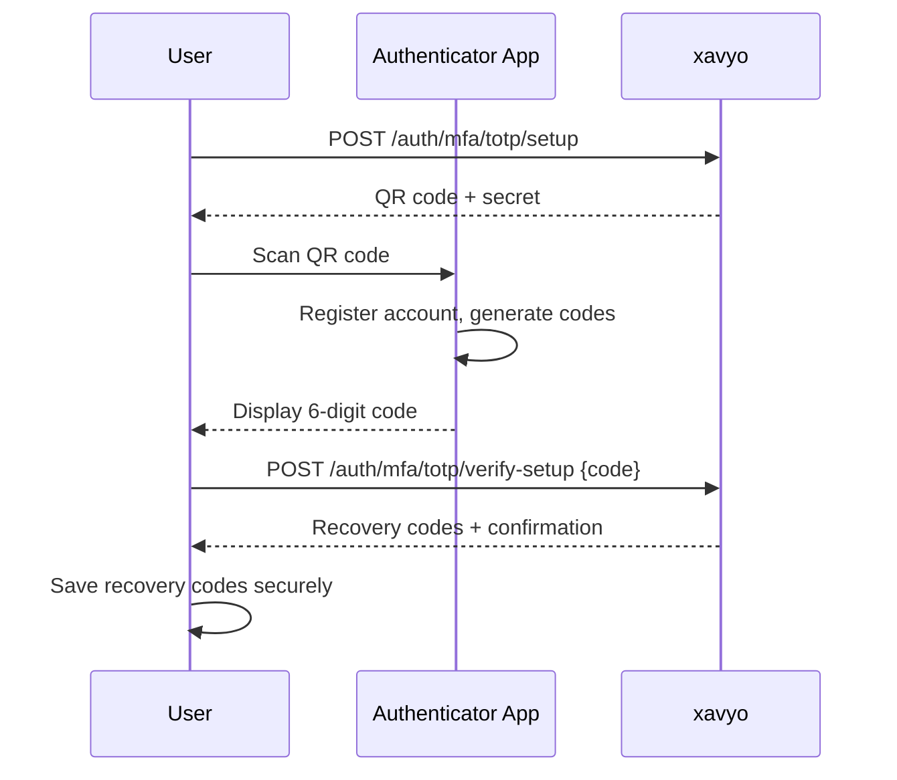

# Multi-Factor Authentication (MFA) Setup

Multi-factor authentication adds a second layer of security to your account. Even if your password is compromised, an attacker cannot access your account without the second factor. xavyo supports two MFA methods:

| Method | How It Works | Examples |
|--------|-------------|---------|
| **TOTP** | Time-based one-time passwords from an authenticator app | Google Authenticator, Authy, 1Password |
| **WebAuthn / FIDO2** | Cryptographic authentication with a physical security key or biometric | YubiKey, Touch ID, Windows Hello |

## Check Your MFA Status

Before setting up MFA, check whether it is already enabled:

```bash
curl https://idp.example.com/me/mfa \
  -H "Authorization: Bearer $TOKEN"
```

**Response:**

```json
{
  "totp_enabled": false,
  "webauthn_enabled": false,
  "recovery_codes_remaining": 0,
  "available_methods": [],
  "setup_at": null,
  "last_used_at": null
}
```

If `totp_enabled` or `webauthn_enabled` is `true`, MFA is already configured. See [Disabling MFA](#disabling-mfa) if you need to reconfigure.

## Setting Up TOTP

TOTP (Time-based One-Time Password) works with any standard authenticator app. The setup process has two steps: initiate setup to receive a QR code, then verify a code from your app to confirm it is working.

### Step 1: Initiate TOTP Setup

```bash
curl -X POST https://idp.example.com/auth/mfa/totp/setup \
  -H "Authorization: Bearer $TOKEN"
```

**Response (200 OK):**

```json
{
  "secret": "JBSWY3DPEHPK3PXP",
  "otpauth_uri": "otpauth://totp/xavyo:alice@example.com?secret=JBSWY3DPEHPK3PXP&issuer=xavyo",
  "qr_code": "data:image/png;base64,iVBORw0KGgo..."
}
```

| Field | Description |
|-------|-------------|
| `secret` | Base32-encoded secret key (manual entry fallback) |
| `otpauth_uri` | Standard URI for authenticator app registration |
| `qr_code` | Base64-encoded PNG QR code image |

**To configure your authenticator app:**

1. Open your authenticator app (Google Authenticator, Authy, 1Password, etc.)
2. Tap "Add account" or the "+" button
3. Scan the QR code from the `qr_code` field, or manually enter the `secret`
4. The app will begin generating 6-digit codes that change every 30 seconds

### Step 2: Verify Setup

Enter a code from your authenticator app to confirm the setup:

```bash
curl -X POST https://idp.example.com/auth/mfa/totp/verify-setup \
  -H "Authorization: Bearer $TOKEN" \
  -H "Content-Type: application/json" \
  -d '{
    "code": "123456"
  }'
```

**Response (200 OK):**

```json
{
  "recovery_codes": [
    "ABCD-1234-EFGH",
    "IJKL-5678-MNOP",
    "QRST-9012-UVWX",
    "YZAB-3456-CDEF",
    "GHIJ-7890-KLMN",
    "OPQR-1234-STUV",
    "WXYZ-5678-ABCD",
    "EFGH-9012-IJKL"
  ],
  "message": "MFA has been enabled. Store your recovery codes safely - they will not be shown again."
}
```

:::danger
**Save your recovery codes immediately.** These codes are displayed only once and cannot be retrieved later. Store them in a secure location such as a password manager or a printed document kept in a safe place. If you lose access to your authenticator app and your recovery codes, you will be locked out of your account.
:::

### TOTP Setup Flow



## Setting Up WebAuthn (FIDO2)

WebAuthn uses hardware security keys or platform authenticators (like fingerprint readers) for phishing-resistant authentication.

### Step 1: Start Registration

```bash
curl -X POST https://idp.example.com/auth/mfa/webauthn/register/start \
  -H "Authorization: Bearer $TOKEN" \
  -H "Content-Type: application/json" \
  -d '{
    "name": "YubiKey 5 NFC"
  }'
```

**Response (200 OK):**

Returns a WebAuthn `PublicKeyCredentialCreationOptions` object that your browser or client uses to prompt for the security key.

### Step 2: Complete Registration

After the user interacts with their security key, send the credential response:

```bash
curl -X POST https://idp.example.com/auth/mfa/webauthn/register/finish \
  -H "Authorization: Bearer $TOKEN" \
  -H "Content-Type: application/json" \
  -d '{
    "credential": { ... }
  }'
```

The `credential` field contains the `PublicKeyCredential` response from the browser's `navigator.credentials.create()` API.

:::info
WebAuthn registration requires a browser environment that supports the Web Authentication API. CLI-only setups should use TOTP instead.
:::

## Using MFA During Login

Once MFA is enabled, the login flow adds a second step.

### Login with TOTP

When you log in with your password, xavyo returns a partial token instead of a full access token:

```bash
# Step 1: Login with password
curl -X POST https://idp.example.com/auth/login \
  -H "Content-Type: application/json" \
  -H "X-Tenant-ID: $TENANT_ID" \
  -d '{
    "email": "alice@example.com",
    "password": "MyP@ssw0rd_2026"
  }'
```

**Response (MFA Required):**

```json
{
  "mfa_required": true,
  "partial_token": "eyJhbGciOiJSUzI1NiIs...",
  "available_methods": ["totp", "webauthn", "recovery"]
}
```

```bash
# Step 2: Verify with TOTP code
curl -X POST https://idp.example.com/auth/mfa/totp/verify \
  -H "Content-Type: application/json" \
  -H "X-Tenant-ID: $TENANT_ID" \
  -d '{
    "partial_token": "eyJhbGciOiJSUzI1NiIs...",
    "code": "123456"
  }'
```

**Response (200 OK):**

```json
{
  "access_token": "eyJhbGciOiJSUzI1NiIs...",
  "refresh_token": "dGhpcyBpcyBhIHJlZnJlc2g...",
  "token_type": "Bearer",
  "expires_in": 3600
}
```

### Login with WebAuthn

```bash
# Step 1: Start WebAuthn authentication
curl -X POST https://idp.example.com/auth/mfa/webauthn/authenticate/start \
  -H "Content-Type: application/json" \
  -d '{
    "partial_token": "eyJhbGciOiJSUzI1NiIs..."
  }'

# Step 2: Complete with security key response
curl -X POST https://idp.example.com/auth/mfa/webauthn/authenticate/finish \
  -H "Content-Type: application/json" \
  -d '{
    "partial_token": "eyJhbGciOiJSUzI1NiIs...",
    "credential": { ... }
  }'
```

### Login with Recovery Code

If you lose access to your authenticator app and security key, use a recovery code:

```bash
curl -X POST https://idp.example.com/auth/mfa/recovery/verify \
  -H "Content-Type: application/json" \
  -H "X-Tenant-ID: $TENANT_ID" \
  -d '{
    "partial_token": "eyJhbGciOiJSUzI1NiIs...",
    "code": "ABCD-1234-EFGH"
  }'
```

:::warning
Each recovery code can only be used once. After using a code, it is permanently consumed. Check `recovery_codes_remaining` in your MFA status to see how many codes you have left.
:::

## Managing Recovery Codes

### Check Remaining Codes

```bash
curl https://idp.example.com/me/mfa \
  -H "Authorization: Bearer $TOKEN"
```

Look at the `recovery_codes_remaining` field. When it reaches zero, consider regenerating codes.

### Regenerate Recovery Codes

If you have used several recovery codes or suspect they may have been compromised, regenerate a new set. This invalidates all previous recovery codes:

```bash
curl -X POST https://idp.example.com/auth/mfa/recovery/regenerate \
  -H "Authorization: Bearer $TOKEN"
```

:::danger
Regenerating recovery codes immediately invalidates all previous codes. Make sure to save the new codes before discarding the old ones.
:::

## Disabling MFA

To disable MFA, you must provide both your password and a current TOTP code (to prove you still have access to the second factor):

```bash
curl -X DELETE https://idp.example.com/auth/mfa/totp \
  -H "Authorization: Bearer $TOKEN" \
  -H "Content-Type: application/json" \
  -d '{
    "password": "MyP@ssw0rd_2026",
    "code": "123456"
  }'
```

**Response (200 OK):**

```json
{
  "message": "MFA has been disabled."
}
```

:::warning
If your organization's tenant policy requires MFA, you will not be able to disable it. The request will return a `403 Forbidden` error with the message "Cannot disable MFA when required by tenant policy."
:::

## Tenant MFA Policies

Your organization's administrator can configure MFA policies that affect your options:

| Policy | Effect |
|--------|--------|
| **Optional** | MFA is available but not required. You can enable and disable it freely. |
| **Required** | MFA must be enabled. You cannot disable it once set up. New accounts must set up MFA during onboarding. |
| **Disabled** | MFA is not available for this tenant. Setup attempts will be rejected. |

## Troubleshooting

### "Invalid TOTP code" errors

- Ensure your device clock is synchronized. TOTP codes are time-based and a clock drift of more than 30 seconds will cause validation failures.
- Make sure you are using the correct account in your authenticator app if you have multiple xavyo accounts.
- Codes expire every 30 seconds. Enter the code promptly after it appears.

### "MFA setup not initiated" error

The TOTP setup process requires two requests in sequence. Make sure you call `/auth/mfa/totp/setup` before `/auth/mfa/totp/verify-setup`. The setup state expires after 10 minutes.

### "TOTP verification is temporarily locked"

After too many failed verification attempts, TOTP verification is temporarily locked. Wait 5 minutes before trying again.

### Lost access to authenticator app

Use one of your recovery codes to log in, then disable MFA and set it up again with a new authenticator. If you have no recovery codes remaining, contact your organization's administrator to reset your MFA.
