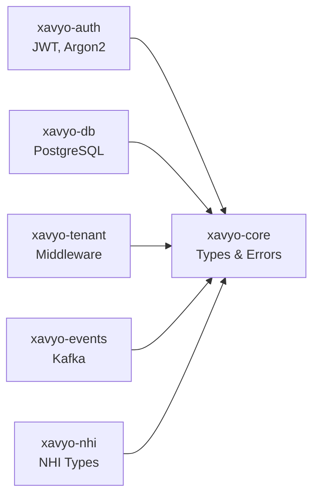
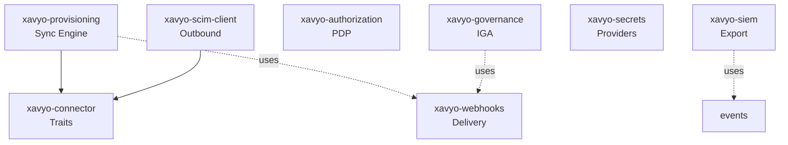
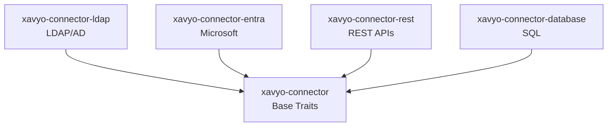

# Dependency Graph

Visual representation of how xavyo crates relate to each other.

## Layer Overview

```mermaid
flowchart TB
    subgraph API["API Layer"]
        api-auth[xavyo-api-auth]
        api-oauth[xavyo-api-oauth]
        api-users[xavyo-api-users]
        api-agents[xavyo-api-agents]
        api-scim[xavyo-api-scim]
        api-saml[xavyo-api-saml]
        api-social[xavyo-api-social]
        api-governance[xavyo-api-governance]
        api-connectors[xavyo-api-connectors]
        api-tenants[xavyo-api-tenants]
        api-authorization[xavyo-api-authorization]
        api-import[xavyo-api-import]
        api-oidc[xavyo-api-oidc-federation]
        api-nhi[xavyo-api-nhi]
    end

    subgraph Connectors["Connector Layer"]
        conn-ldap[xavyo-connector-ldap]
        conn-entra[xavyo-connector-entra]
        conn-rest[xavyo-connector-rest]
        conn-db[xavyo-connector-database]
    end

    subgraph Domain["Domain Layer"]
        connector[xavyo-connector]
        provisioning[xavyo-provisioning]
        governance[xavyo-governance]
        authorization[xavyo-authorization]
        webhooks[xavyo-webhooks]
        siem[xavyo-siem]
        secrets[xavyo-secrets]
        scim-client[xavyo-scim-client]
    end

    subgraph Foundation["Foundation Layer"]
        core[xavyo-core]
        auth[xavyo-auth]
        db[xavyo-db]
        tenant[xavyo-tenant]
        events[xavyo-events]
        nhi[xavyo-nhi]
    end

    %% Foundation dependencies
    auth --> core
    db --> core
    tenant --> core
    events --> core
    nhi --> core

    %% Domain dependencies
    connector --> core
    provisioning --> connector
    provisioning --> events
    provisioning --> db
    governance --> core
    governance --> db
    authorization --> core
    authorization --> db
    webhooks --> core
    webhooks --> events
    siem --> core
    siem --> events
    secrets --> core
    scim-client --> connector

    %% Connector dependencies
    conn-ldap --> connector
    conn-entra --> connector
    conn-rest --> connector
    conn-db --> connector

    %% API dependencies (simplified - showing key deps)
    api-auth --> auth
    api-auth --> db
    api-oauth --> auth
    api-oauth --> db
    api-users --> auth
    api-users --> db
    api-agents --> auth
    api-agents --> secrets
    api-agents --> nhi
    api-scim --> db
    api-governance --> governance
    api-connectors --> provisioning
    api-authorization --> authorization
```

## Foundation Layer Detail

## Domain Layer Detail

## Connector Implementations

## Key External Dependencies

| Crate | Key External Deps |
|-------|------------------|
| xavyo-auth | jsonwebtoken, argon2 |
| xavyo-db | sqlx, postgres |
| xavyo-events | rdkafka |
| xavyo-connector-ldap | ldap3 |
| xavyo-connector-entra | reqwest |
| xavyo-secrets | reqwest (Vault), aws-sdk |
| xavyo-webhooks | reqwest |
| xavyo-siem | tokio (TCP/UDP) |

## Circular Dependency Prevention

The layer architecture prevents circular dependencies:

1. **Foundation** → No internal deps (except core)
2. **Domain** → Foundation only
3. **Connector** → Domain (connector base)
4. **API** → All lower layers

Never create dependencies that go "up" the stack (e.g., Foundation depending on Domain).
